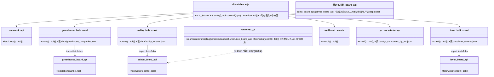
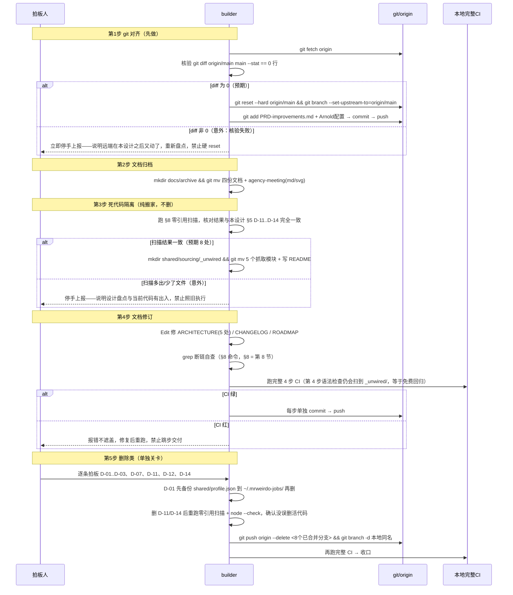

# DESIGN — Mr. Weirdo Jobs 项目规整（盘点 + 方案）

> **一句话结论**（第 2 轮修订，推翻了第 1 轮的一条结论）：乱在四处——**死代码**（约 2,500 行写了但从没接进流程的模块，第 1 轮漏判为"没有错放的代码文件"）、**文档线**（4 份过时文档冒充现行文档）、**git 卫生**（本地 main 状态误判 + 8 个已合并分支没清）、**垃圾与错放文件**（含一份真实个人资料错放在仓库里）。技能组织反而是全项目最整齐的一块（20 个技能命名统一、无孤儿），不用动。方案分 6 步，每步独立可拍板、独立 commit。

---

# 第一部分：给拍板人的人话版

## 1. 现状问题（盘点结论）

**先说不乱的（不需要动的）**：

- **顶层目录职责清晰**：`bin/`（npx 安装入口）、`scripts/`（发布/演示检查，7 个脚本全部被 package.json 或 CI 引用）、`shared/`（核心引擎）、`test/`（30 个测试文件）、`examples/`（示例与覆盖度夹具——`coverage_fixtures/` 被 `scripts/coverage_matrix_check.mjs` 逐个引用、`example_company_list.json` 被 `scripts/public_alpha_gate.mjs` 硬核查、`walkthrough.md` 被 README 链接）。**目录的边界没问题，问题在 `shared/` 里面（见问题 D）**。
- **技能组织**（全项目最整齐的一块）：`.claude/skills/` 下 20 个技能，命名全部统一 `mrweirdo-*` 前缀，`-auto` 后缀规则一致（自动提交版 vs 带确认门的手动版）；目录形态一致（每个一份 SKILL.md，onboard/doctor 额外带 `agents/openai.yaml`，onboard 带 `references/` 两份分册——是刻意的大技能拆分，不是乱）。逐个 grep 核对：**没有孤儿技能**——疑似孤儿的 4 个（expand / materials / tracker / upskill）都被 onboard 主技能、测试 `phase3_skill_policy.test.mjs`、`demo_check.mjs` 真实引用。
- **README 门面**：所有链接指向的文件都存在，本方案保证规整后仍然有效。

**真正乱的四处**：

### 问题 A：文档线——过时文档冒充现行文档

| 文件 | 问题 |
|---|---|
| `docs/ARCHITECTURE.md` | **与代码漂移 4 处**：① 文档说 lever-auto 是 onboard 流程调用的自动提交器，但代码里 `SUPPORTED_AUTO_PLATFORMS` 只有 greenhouse + ashby，lever 明确列在"已知不支持"里（这正是 PRD-improvements 里 P3 优先级——第三优先级"修 Lever"要修的 bug）；② 漏了 4 个辅助技能（expand/materials/tracker/upskill）；③ "Review Surfaces（查看面）"段写 Notion 是"可选的用户自有镜像"，而实现它的 `shared/notion_sync.mjs` 全项目**无任何代码引用**（只在 `local_db.mjs` 第 12 行的注释里被提了一句"接口沿用 v1.0 的 notion_sync"）——文档承诺了一个已经断线的能力；④ 通篇没提 `shared/sourcing/` 下 5 个已写好但没接线的抓取模块（问题 D），读者会以为 dispatcher 支持的平台比实际多。 |
| `HANDOFF.md`（根目录，22KB） | 自称"看这一份就能接手"，但停在 2026-05-28；之后 origin/main 有 **38 个提交**没反映。新维护者照它接手会被误导。 |
| `CHANGELOG.md` | 同样停在 5 月 28 日：6 月的 38 个提交（含 D1 求职信、投递 gating 修复、onboarding 改版等大活）**一笔没记**；"[Unreleased]（未发布段）"还挂着 5 月的旧内容，而 VERSION 已是 v2.2.0。 |
| `docs/PRD-v3.md`、`docs/PRD-onboarding-ux.md` | 均已实施上线（6 月 13 日 shipped），但和现行的 `PRD-improvements.md` 平铺在同一层，3 份 PRD 并存，分不清哪份是现行的。 |
| `docs/PRD-improvements.md`、`docs/agency-meeting/` | 未提交 git——机器一坏就丢。前者是**现行最新 PRD**，必须入库。 |

### 问题 B：GitHub 卫生——一个好消息 + 一堆没清的分支

- **好消息**：任务档案里记的"main 有 1 个未推提交（3e15692 README 美化）"经实际 diff 核验是**误判**——该提交内容已通过 PR #9 squash（压缩合并）进了 origin/main，本地 main 与远端内容**逐字节一致**（diff = 0 行）。所以不需要 push，只需要把本地 main 对齐远端 + 设置跟踪上游，零内容风险。
- 远端 9 个功能分支里 **8 个已完全合并**进 main（含 readme-banner，squash 合并已 diff 验证），留着只会让人误以为有在途工作。
- 唯一未合并的 `feat/funnel-report-card`（漏斗战报卡，420 行真实功能）——**这是产品决策不是卫生问题**，列入 ROADMAP 等拍板"合并还是废弃"，本轮不动。

### 问题 C：垃圾与错放文件

- **`shared/profile.json` = 你的真实个人资料错放在仓库目录里**（Notion 标准答案库 5 月 23 日导出）。目前靠 .gitignore 挡着没进 git，但这是"在火药库旁边放打火机"：npm 发布白名单或 gitignore 将来一改就可能泄露。家目录 `~/.mrweirdo-jobs/profile.json` 有更新版（6 月 14 日，且是流水线真正读的那份），仓库里这份是过期冗余。
- `.tmp-scoring/`（6 月 10 日打分临时中间产物，14 个文件，一个多月没动）。
- 治理缺口：`file_size_limits.json`（文件行数红线表）**没写 `.mjs` 这一行**——而本项目主语言就是 .mjs，等于膨胀纪律对绝大部分代码不生效。现状 `greenhouse_apply_driver.mjs` 已 1917 行、`ashby_apply_driver.mjs` 1170 行，两个都不在管辖范围内（`.js` 那行管住的只有 `ashby_helpers.js` 1243 行等几个 helper）。

### 问题 D：死代码——写好了但从没接进流程（第 1 轮漏判，本轮实测补上）

这才是"architecture 乱"的实感来源：`shared/` 平铺 60+ 个文件里，有 **8 个模块（约 2,500 行）从任何入口都走不到**。核对方法不是看名字猜，是拉全量引用图：把每个模块的文件名在 `shared/ scripts/ test/ bin/ .claude/skills/ setup.sh package.json` 里全文搜一遍，再逐条区分"真的 import"和"只是注释里提了一嘴"。

| 模块 | 行数 | 实际状态 |
|---|---|---|
| `shared/sourcing/smartrecruiters_board_api.mjs` | 412 | **零引用**。`dispatcher.mjs`（找岗总调度）只动态载入 6 个来源：remoteok / greenhouse_bulk_crawl / ashby_bulk_crawl / lever_bulk_crawl / wellfound_search / yc_workatastartup——这 5 个抓取模块一个都不在里面 |
| `shared/sourcing/rippling_board_api.mjs` | 338 | 同上。仅在 `personio/bamboohr` 的注释头里被互相提及（"接口对齐 xxx"），不构成调用 |
| `shared/sourcing/personio_board_api.mjs` | 332 | 同上 |
| `shared/sourcing/bamboohr_board_api.mjs` | 319 | 同上 |
| `shared/sourcing/recruitee_board_api.mjs` | 253 | 同上 |
| `shared/notion_sync.mjs` | 463 | Notion 时代的遗留同步器，已被 `local_db.mjs`（本地 SQLite）取代；零代码引用，但 ARCHITECTURE.md 仍对外承诺"Notion 可选镜像" |
| `shared/computer_use_locator.mjs` | 224 | v0.5 视觉兜底定位器（CDP 选择器失效时用视觉找元素），零引用 |
| `shared/migrate_notion_to_local.mjs` | 190 | 一次性迁移脚本（Notion → 本地库），2026-05-24 加入，迁移早已完成 |
| `shared/config.template.json` | — | 零引用（只在 CHANGELOG 的历史叙述里出现）；现行模板是 `profile.template.json` / `essay_profile.template.json`，这两个都真被 helper 和测试引用 |
| `shared/references/job_report_template.md` | — | 零引用（同目录的 `truthfulness.md` 被 3 处技能引用，对比明显） |

**关键判断：这 8 个模块不是"垃圾"，是"备料"。** 全部诞生于 2026-05-23 同一批广度建设，每个都带独立命令行入口（可以手工 `node shared/sourcing/personio_board_api.mjs` 跑），代码本身没坏——只是从没接进 dispatcher。所以处置不能一刀切删：**5 个抓取模块建议先隔离标注、不删**（PRD-improvements 里"扩覆盖面"仍是候选方向，删了将来要重写）；**3 个 Notion / 视觉兜底遗留建议删**（对应的时代已经过去）。逐条见 §5 删除清单 D-11 ～ D-13。

## 2. 目标结构

```text
mrweirdo-jobs/
├── README / DISCLAIMER / LICENSE / CHANGELOG / VERSION / setup.sh   ← 对外门面，路径全部不动（npm files 白名单引用根路径）
├── bin/  scripts/  test/  examples/                                 ← 不动
├── shared/                                                          ← 活代码平铺结构不动（理由见 ADR-1）
│   └── sourcing/_unwired/   ← 【新建】5 个写好但没接线的抓取模块搬进来 + 一份 README 说清"接线要改哪两处"
├── .claude/skills/                                                  ← 20 个技能，不动
└── docs/
    ├── ARCHITECTURE.md          ← 修订到与代码一致（现行）
    ├── PRD-improvements.md      ← 现行唯一 PRD（提交入库）
    ├── ROADMAP.md / BACKLOG.md  ← 看板（主线）/ 工程细粒度待办，分工保留
    ├── PUBLIC_ALPHA.md          ← 仍有效，保留
    ├── active/                  ← 过程稿（任务档案、阶段产物）
    ├── specs/                   ← 定稿说明书
    └── archive/                 ← 【新建】已完成使命的历史文档：
        PRD-v3.md、PRD-onboarding-ux.md、HANDOFF.md、
        launch-posts.md、agency-meeting/（md+svg 入库，PDF 不入库）
```

核心原则两条：

1. **docs/ 三线制**——现行文档在 docs/ 根、过程稿在 active/、退役文档在 archive/（git mv 保留历史）。谁看到 docs/ 根目录的文件，都可以默认它是现行有效的。
2. **代码只有两种状态：接线的 / 明确标注没接线的**——不允许"看起来像在用其实走不到"的第三种。`shared/sourcing/` 平层从此只放 dispatcher 真能走到的模块。

## 3. 分步搬迁方案（6 步，每步独立 commit + 独立可拍板）

| 步骤 | 内容 | 风险 | 预估 |
|---|---|---|---|
| **第 1 步 git 对齐**（先做，为后面所有 commit 打底） | `git fetch` → 本地 main 对齐 origin/main（内容已验证一致）→ 设置跟踪上游；提交 PRD-improvements.md + Arnold 配置文件 | 低（diff=0 已验证） | 10 分钟 |
| **第 2 步 文档归档** | 新建 docs/archive/；`git mv` 搬 PRD-v3、PRD-onboarding-ux、HANDOFF、examples/launch-posts.md；agency-meeting 的 md+svg 归档入库、2 个 PDF（1.5MB）不入库（md 在可随时重新生成） | 低（纯移动，保历史） | 20 分钟 |
| **第 3 步 死代码隔离**（问题 D，本轮新增） | 新建 `shared/sourcing/_unwired/` + README，`git mv` 5 个没接线的抓取模块进去；ARCHITECTURE.md 补一段"接线的来源 vs 备料"。**这一步不删任何代码**，纯搬家 | 低（这 5 个文件零引用，实测过；搬完 CI 语法检查仍覆盖它们） | 20 分钟 |
| **第 4 步 文档修订** | Edit 修 ARCHITECTURE.md 四处漂移（lever 现状如实标注、补 4 个辅助技能、Notion 段改为"已断线/历史"、补备料说明）；CHANGELOG 补 6 月记账（折叠成 v2.3.0 或按主题）；ROADMAP 排入 PRD-improvements 的 P1/P2/P3（第一/二/三优先级） | 中（要与代码逐条核对） | 1-2 小时 |
| **第 5 步 垃圾清理**（删除类，逐条见 §5 清单，拍板后才执行） | 删 shared/profile.json（家目录有新版）、删 .tmp-scoring/、删 3 个 Notion/视觉兜底遗留模块、删 8 个已合并分支（远端+本地） | 见清单逐条 | 20 分钟 |
| **第 6 步 治理补丁** | file_size_limits.json 补 `.mjs: 800` 一行（新纳入管辖的 2 个存量超限 .mjs 文件自动进入"只减不增"模式，不需要立刻拆） | 低 | 5 分钟 |

**建议缓做/本轮不做**：`shared/` 活代码平铺（清完死代码后仍有 60+ 文件）的内部分组重构。理由：20 个技能 SKILL.md + 30 个测试文件 + 若干脚本都写死了 `shared/xxx.mjs` 路径，搬一个文件要全量改引用、全量回归；对用户价值低（这层只有维护者看）、风险面大（主流程"简历上传→找岗→大批量一键投递"全走这些路径）。**取舍面：彻底 vs 稳，本轮选稳**——注意第 3 步已经吃掉了"乱"的大头（把走不到的代码挪出视线），剩下的重组收益递减。不同意可拍板加做，需单独任务 + verify 全量回归。

## 4. 施工纪律（沿用本项目一贯做法）

每步单独 commit；push 前在本地跑**完整 CI 每一步**（.github/workflows/ci.yml 四步：npm test → role_guard_smoke → public_alpha_gate → 全量 node --check），不是只跑 npm test。

## 5. 建议删除清单（只提议，逐条等拍板，本设计不执行任何删除）

| # | 路径 | 为什么没用 | 删错的风险 | 建议 |
|---|---|---|---|---|
| D-01（删除项 1） | `shared/profile.json` | 真实个人资料的 5 月 23 日过期快照；流水线真正读的是 `~/.mrweirdo-jobs/profile.json`（6 月 14 日，更新、内容已 diff 确认不同）；错放仓库内是隐私隐患 | 若家目录那份反而缺了这份里的某些答案会丢信息——建议删前把本份先复制到 `~/.mrweirdo-jobs/archive-repo-20260704/` 一起留底 | **删**（先备份到家目录） |
| D-02 | `.tmp-scoring/`（14 个文件，1.4MB） | 6 月 10 日演示准备期的打分临时中间产物，gitignored，结果早已入库 jobs.db；一个多月无人碰 | 想复盘当时打分过程会丢——概率低，且 devlog 已记录结论 | **删** |
| D-03 | 远端 8 个已合并分支：chore/changelog-fold-v2.2.0、codex/public-alpha-release-gate、fix/lever-upload、refactor/extract-answer-buckets、refactor/extract-pure-logic、release/v2.2.0、test/regression-harness、readme-banner | `git branch -r --merged origin/main` 确认前 7 个完全合并；readme-banner 是 squash 合并、内容已 diff 验证在 main 里 | 极低（内容都在 main，且 commit SHA 在 reflog/PR 里可追） | **删**（远端 + 本地同名分支） |
| D-04 | `feat/funnel-report-card` 分支 | —— 不删。420 行未合并真实功能（投递漏斗战报卡） | 删了功能就丢了 | **留**，进 ROADMAP 等产品拍板：合并 or 废弃 |
| D-05 | `HANDOFF.md`（根目录） | 停在 5 月 28 日，之后 38 个提交未反映，继续放根目录会误导接手人 | 里面的"dragons（历史坑）"记录仍有考古价值 | **归档**到 docs/archive/（不删） |
| D-06 | `docs/PRD-v3.md`、`docs/PRD-onboarding-ux.md` | 已实施上线（6 月 13 日），使命完成；与现行 PRD 并存造成"哪份算数"混乱 | 历史决策依据仍要可查 | **归档**（git mv 保历史） |
| D-07 | `docs/agency-meeting/` 的 2 个 PDF（共 1.5MB） | 会议已结束无 follow-up；PDF 是 md 的编译产物，md 在即可随时重新生成 | 二进制入 git 则仓库体积永久 +1.5MB；不入库放本地则机器坏了丢——但可再生成，损失为零 | md + svg **归档入库**；PDF **删**（不入库） |
| D-08 | `examples/launch-posts.md` | 自我标注 "historical drafts"，历史发布文案草稿；examples/ 里其余文件都被脚本/README 真实引用，唯它无代码引用 | HANDOFF.md 里有一处文字提及（两者一起进 archive，可接受） | **归档**到 docs/archive/ |
| D-09 | `.gstack/browse-audit.jsonl`（5KB） | 6 月 14 日浏览器审计日志，gitignored | 无 | 可删可留，**低优先**，不值得占拍板注意力 |
| D-10（清单第 10 条） | `.agents/skills/` 比 `.claude/skills/` 少 4 个链接（缺 expand/materials/tracker/upskill 四个技能） | 不是删除项——是 setup.sh 生成物过期，且整个 `.agents/` 已被 gitignore 忽略（纯本地产物） | —— | 重跑 `bash setup.sh` 刷新即可（builder 顺手做） |
| D-11（清单第 11 条，Notion 遗留） | `shared/notion_sync.mjs`（463 行）、`shared/migrate_notion_to_local.mjs`（190 行） | Notion 时代遗留：同步器已被 `local_db.mjs` 本地 SQLite 完全取代（`local_db.mjs` 注释里明写"接口沿用 v1.0 的 notion_sync"= 继任者已就位）；迁移脚本是一次性的，5 月 24 日加入，迁移早已完成。二者全项目零代码引用 | 若将来还想做 Notion 镜像要重写——但那时数据表结构已经变了，旧代码本来也要大改；git 历史里永远可取回 | **删**（同时改 ARCHITECTURE.md 的 Notion 段，别再对外承诺一个断线能力） |
| D-12（清单第 12 条，视觉兜底） | `shared/computer_use_locator.mjs`（224 行） | v0.5 视觉兜底定位器（选择器失效时改用视觉找页面元素），零引用，从没接进任何投递驱动 | 这是有想法的备料，删了将来重做要费劲 | **建议留、但挪进 `_unwired/`（未接线区）**——若拍板人想更干净，删也可接受（git 可取回）。我倾向挪不删 |
| D-13（清单第 13 条，未接线抓取模块） | `shared/sourcing/` 下 5 个：smartrecruiters（412 行）/ rippling（338）/ personio（332）/ bamboohr（319）/ recruitee（253）_board_api.mjs，共 1,654 行 | 找岗总调度 dispatcher 从没载入过它们，是 5 月 23 日广度建设的备料 | **删错代价最大的一条**：PRD-improvements 明确说覆盖面还要扩，这 5 个平台的抓取逻辑（含 Personio 的 XML 解析这类不好写的部分）删了要重写 | **不删，挪进 `shared/sourcing/_unwired/` 并写清接线方法**（改 dispatcher 的来源表 + 加一条 `ALL_SOURCES` 项）。若拍板人认为这些平台永不做，再单独拍板删 |
| D-14（清单第 14 条，废弃模板） | `shared/config.template.json`、`shared/references/job_report_template.md` | 均零引用；现行模板是 `profile.template.json` / `essay_profile.template.json`（真被 helper 与测试引用），岗位报告模板逻辑已内联在 `job_report.mjs` 里 | 极低 | **删** |

---

# 第二部分：技术细节（给 builder / verify）

## 6. Implementation Approach

需求本质是一次 **audit + 低风险重组**：难点不在搬文件，而在（a）证明"哪些东西真的没用"——本设计对每个疑似孤儿/死文件都做了引用图核对与 git diff 核验，结论见 §5 清单（第 5 节删除清单）；

**死代码判定方法（可复现，verify 照着复核）**：对 `shared/` 下每个 `.mjs`/`.js`，把文件名在 `shared/ scripts/ test/ bin/ .claude/skills/ setup.sh package.json` 全文搜一遍，排除自身文件；命中数为 0 = 死。命中数非 0 的还要再看一眼命中行是**真 import 还是注释**——这一步是关键：5 个未接线抓取模块彼此在注释头里互相"致敬"（`Interface mirrors xxx_board_api.mjs`），只看命中数会全部误判为活。第 1 轮设计就栽在没做这步区分，直接下了"没有错放的代码文件"的结论，本轮修正。

（b）保证搬动不破坏三类活引用：README 对外链接、npm files 白名单（根目录 DISCLAIMER.md/README.md/VERSION 等不可搬）、PRD-improvements 引用的代码路径（`shared/sourcing/apply_url_classification.mjs` 等——本轮不动 shared/，天然保持有效）。

选型 trade-off（取舍）论证：

- **git 对齐方式**：本地 main（3e15692）与 origin/main（d9a4369）历史分叉但内容零差异（squash 合并所致）。选 `git reset --hard origin/main` 而非 merge/rebase——因为 diff=0，reset 是唯一不制造空 merge 提交的干净做法；untracked 文件（未跟踪文件）不受 reset 影响，无内容损失。
- **归档方式**：`git mv` 而非删除+新建——保留 `git log --follow` 历史链。
- **CHANGELOG 补账粒度**：38 个提交逐条补不现实且无读者价值；按主题折叠成一个 v2.3.0 段（D1 求职信 / 投递修复 / onboarding 改版 / CI 修复四个主题），每主题给关键 commit SHA 供考古。
- **ARCHITECTURE.md 修订方向**：如实写现状（lever 不在自动队列、Notion 同步已断线）而非写目标态（PRD-improvements P3 修完后的样子）——文档与代码冲突时以代码为准，等 P3（第三优先级：修 Lever）落地时再随代码一起改。
- **死代码处置分两类而不是一刀切**：判据是"重写成本 vs 留着的困惑成本"。5 个抓取模块重写成本高（含各平台接口怪癖）、且路线图上还想要 → 隔离标注；3 个 Notion/视觉遗留重写成本低或时代已过 → 删。**取舍面：干净 vs 可复用，本条按"重写成本"分线，不按感觉一刀切。**

## 7. File List

**要新建**：

| 路径 | 内容 | 行数级 |
|---|---|---|
| `docs/archive/README.md` | 3 行：本目录是退役文档档案柜，内容只增不改 | ~5 |
| `shared/sourcing/_unwired/README.md` | 说清三件事：这里的模块 dispatcher 走不到、每个是什么平台什么状态、要接线得改哪两处（dispatcher 来源表 + `ALL_SOURCES`） | ~20 |

**要移动（git mv，内容不改）**：

| 从 | 到 |
|---|---|
| `docs/PRD-v3.md` | `docs/archive/PRD-v3.md` |
| `docs/PRD-onboarding-ux.md` | `docs/archive/PRD-onboarding-ux.md` |
| `HANDOFF.md` | `docs/archive/HANDOFF-v2.2.0.md` |
| `examples/launch-posts.md` | `docs/archive/launch-posts.md` |
| `docs/agency-meeting/{A-cheat-sheet.md,B-intro.md,workflow.svg}` | `docs/archive/agency-meeting/`（先 git add 再算 mv；2 个 PDF 不入库，处置见 D-07） |
| `shared/sourcing/{smartrecruiters,rippling,personio,bamboohr,recruitee}_board_api.mjs` | `shared/sourcing/_unwired/`（5 个文件；均零引用，搬动不需改任何 import） |
| `shared/computer_use_locator.mjs` | `shared/sourcing/_unwired/` 或 `shared/_unwired/`（看 D-12 怎么拍；若拍"删"则此行作废） |

**要修改（全部用 Edit 精准替换）**：

| 路径 | 改什么 | 影响 |
|---|---|---|
| `docs/ARCHITECTURE.md` | ① Skill Layout（技能布局）段：lever-auto 从"onboard 调用的 auto-submit helpers"改为如实描述（driver 存在、暂不在自动队列，PRD-improvements P3 待启用）；② 补 4 个辅助技能（expand/materials/tracker/upskill）；③ workday 段标注"v0.7 脚手架、companies/ 6 个文件全是 `_template` 与 `placeholder_company_1..5`、从未实测"；④ Review Surfaces（查看面）段的 Notion 改为"v1.0 历史能力，同步器已随 D-11 移除"；⑤ 新增一段"接线的抓取来源（dispatcher 的 6 个）vs 未接线备料（`_unwired/`）" | ~25 行 |
| `CHANGELOG.md` | [Unreleased] 段收编 + 新增 v2.3.0 主题折叠段（6 月工作补账） | +40 行左右 |
| `docs/ROADMAP.md` | 排队中填入：PRD-improvements P1（投完够格存量）/P2（缺信息不中止）/P3（降门槛+修 Lever）、feat/funnel-report-card 去留决策 | +6 行 |
| `.claude/file_size_limits.json` | limits 里加 `".mjs": 800`（写在 ".js" 行之前之后皆可，无先后冲突）。生效后新纳入管辖的超限文件有 2 个：`greenhouse_apply_driver.mjs`(1917) / `ashby_apply_driver.mjs`(1170)，二者即刻进入"净增 = 0"；`.js` 那行原本就管着的 `ashby_helpers.js`(1243) 状态不变 | +1 行 |
| `docs/active/2026-07-22_project-cleanup_TASK.md` | 各步施工后追加记录 | 持续 |

**要提交（git add，不改内容）**：`docs/PRD-improvements.md`、`.claude/{arnold/,phase_schemas.yaml,file_size_limits.json}`、`CLAUDE.md`、`PROJECT_CONTEXT.yaml`、`PROJECT_MEMORY.md`、`docs/{ROADMAP.md,active/,specs/}`（Arnold 配置是否入库属用户偏好，见 §10 UNCLEAR-4，即第 10 节未明点第 4 条）。

**要删除（拍板后）**：见 §5 清单 D-01、D-02、D-03、D-07（PDF）、D-11、D-14；D-12 待拍（挪 or 删）。

**明确不动**：`bin/ scripts/ test/ .claude/skills/ .github/ setup.sh package.json README.md DISCLAIMER.md LICENSE VERSION docs/PUBLIC_ALPHA.md docs/BACKLOG.md`，以及 `shared/` 下**除上表列出的 8 处死代码之外的全部文件**（活代码一个字节不动——主流程全走这些路径）。

## 8. 数据结构与接口

本任务无新增代码类型；等价物是两张图。第一张 —— **文档-引用依赖图**（谁引用谁 = 搬谁前必须查谁）：

```mermaid
classDiagram
    class README_md { +links: docs/ARCHITECTURE.md; docs/PUBLIC_ALPHA.md; examples/walkthrough.md; DISCLAIMER.md; CHANGELOG.md; LICENSE }
    class package_json { +files白名单: bin/ setup.sh README DISCLAIMER LICENSE VERSION; +scripts: test/smoke/demo/release }
    class ARCHITECTURE_md { +描述: skills布局+driver模型; -漂移: lever-auto定位; -漂移: 缺4个辅助技能 }
    class PRD_improvements_md { +引用: shared/sourcing/apply_url_classification.mjs; shared/workday/; SUPPORTED_AUTO_PLATFORMS }
    class HANDOFF_md { +文字提及: examples/launch-posts.md; -停更: 2026-05-28 }
    class onboard_SKILL { +引用: mrweirdo-expand/materials/tracker/upskill; shared/*.mjs }
    class alpha_gate { +硬核查: .claude/skills/{jobskill,onboard,doctor}/SKILL.md 存在性 }
    README_md --> ARCHITECTURE_md : 链接（不搬,原地修）
    README_md --> package_json : 白名单一致
    PRD_improvements_md --> onboard_SKILL : 路径引用（shared不动=天然有效）
    HANDOFF_md --> archive : 一起归档,提及可接受
    alpha_gate --> onboard_SKILL : CI 硬依赖（skills 目录不动）
```

第二张图 —— **抓取来源可达性图**（问题 D 的证据，也是第 3 步搬家的依据）：



关键接口（施工时的验证命令，即"改完怎么证明没断"）：

```bash
# 死代码判定复现（verify 用；输出的每个文件都应已在 _unwired/ 或已删）
for f in $(find shared -name '*.mjs' -o -name '*.js'); do
  b=$(basename "$f")
  n=$(grep -rlF "$b" shared scripts test bin .claude/skills setup.sh package.json | grep -v "^$f$" | wc -l)
  [ "$n" -eq 0 ] && echo "零引用: $f"
done
# 搬动后全局断链自查：任何被搬文件的旧路径不应再被现行文件引用
grep -rn "PRD-v3\|PRD-onboarding-ux\|launch-posts" --exclude-dir=.git --exclude-dir=docs/archive --exclude-dir=.agents .
grep -rn "HANDOFF" --exclude-dir=.git --exclude-dir=docs/archive --exclude-dir=.agents . | grep -v CHANGELOG  # CHANGELOG 里是历史叙述文字，可留
# git 对齐前置核验（必须输出 0 才许 reset）
git diff origin/main main --stat | wc -l
# 完整 CI（照 .github/workflows/ci.yml 四步）
npm test && node scripts/role_guard_smoke.mjs && node scripts/public_alpha_gate.mjs && for f in $(find shared scripts -name '*.mjs'); do node --check "$f"; done
```

## 9. 调用流



## 10. Anything UNCLEAR

1. **UNCLEAR-1（未明点 1）**：`shared/profile.json` 与家目录版内容确认不同（diff 非空），但**没逐字段核对方向**——理论上存在"旧版里有、新版里丢了"的字段。D-01 的备份步骤就是为此兜底，但若拍板人想稳，可让 builder 删前出一份字段级 diff 给你过目。
2. **UNCLEAR-2**：`feat/funnel-report-card`（漏斗战报卡）合并还是废弃——纯产品决策，architect 无权替拍。已列 ROADMAP 排队。
3. **UNCLEAR-3**：agency-meeting 的 2 个 PDF 是否还有对外用途（比如还要发给中介机构）？本设计按"无 follow-up"处理为可删，若还要用则改为留在本地不入库。
4. **UNCLEAR-4**：Arnold 配置文件（CLAUDE.md / PROJECT_CONTEXT.yaml / .claude/arnold/ 等）入不入 git？入 = 换机器不丢协作纪律；不入 = 对外仓库更干净（这是公开 alpha 仓库，外人会看到你的内部协作配置）。**我倾向入库**（本项目单人维护、配置丢失代价高），请拍板。
5. **UNCLEAR-5**：CHANGELOG 补账后要不要顺势把 VERSION 升到 v2.3.0 并打 tag？涉及对外版本语义（npm 包版本 2.2.0），建议随第 4 步一起拍板。
6. **UNCLEAR-6（本轮新增，最需要你拍的一条）**：5 个未接线抓取模块（SmartRecruiters / Rippling / Personio / BambooHR / Recruitee）的定位是什么？/ A→"路线图上还想扩这些平台"→ 按本设计挪进 `_unwired/` 保留 / B→"这些平台永远不做"→ 直接删掉 1,654 行，`shared/sourcing/` 立刻瘦身 / **我倾向 A**（PRD-improvements 虽然把覆盖面判为非瓶颈，但没说永不做；且这些平台恰好是中小公司主力板，与"大学生找实习"的岗位池重叠度不低）。请确认。
7. **UNCLEAR-7**：`shared/sourcing/_executors/ashby_plan_executor.mjs` 只被 `mrweirdo-ashby-auto` 的 SKILL.md 引用，是"技能直接调用的执行器"——它自成一个 `_executors/` 单文件目录，是有后续计划还是历史残留？我没找到别的执行器，判定不了意图，**未动**，请知情人补一句。
8. **UNCLEAR-8**：三个单 URL 技能（icims / jobvite / smartrecruiters）没有任何上游引用它们（onboard 不调、README 的"Main Commands 主命令表"也没列），只能靠用户手工打斜杠命令触发。这是刻意的"高级用户后门"还是漏登记？影响的是 README 要不要补一行，不影响本轮搬迁。

## 11. 8 项质量属性取舍表

| 属性 | 本方案的量化承诺 | 牺牲了谁 |
|---|---|---|
| Performance 性能 | 不适用（纯文档/git 操作，零运行时影响）；全程施工 ≤ 半天 | —— |
| Scalability 扩展性 | docs/ 三线制可承载后续任意数量过程稿而根目录文件数恒定（现行文档 ≤ 6 份） | 牺牲"一眼看到所有历史"——历史要多点一层进 archive/ |
| Security 安全 | 消除 1 处个人资料错放（shared/profile.json）；npm files 白名单零变更 | —— |
| Maintainability 可维护性 | ARCHITECTURE 漂移清零（5 处修正）；CHANGELOG 缺账 38 提交 → 0；`shared/` 目录下"走得到的代码"占比从 89%（68/76 个模块）→ 100%；死代码 2,530 行从活代码视野里消失；file_size_limits 补 .mjs 后，两个最大的投递驱动（1917 / 1170 行）首次进入膨胀纪律管辖 | 牺牲这 2 个存量超限大文件的"自由生长"（净增 = 0，加功能须先拆） |
| Reliability 可靠性 | 主流程（简历上传→分析定岗→找岗→大批量一键投递→报告→跟进）路径零触碰：被搬/被删的 8 处**实测零引用**，dispatcher 的 6 个来源、3 个 board_api、全部投递驱动与技能一个字节不动；完整 CI 4 步全绿才收口 | 牺牲彻底性——`shared/` 活代码平铺问题本轮明确不解决（ADR-1） |
| Interoperability 互操作 | README 全部对外链接、npm 安装路径、setup.sh 技能链接机制保持逐字有效（§8 grep 自查兜底） | —— |
| Compliance 合规 | 删除类动作 100% 过拍板关卡，0 项静默执行；git mv 保全历史审计链 | 牺牲速度——第 4 步必须等逐条拍板 |
| Cost 成本 | builder 施工总量 ≤ 一天（比第 1 轮的半天多 20 分钟搬家 + 删除核验）；新增仓库体积 ≈ +50KB（文档），拒绝 +1.5MB（PDF 不入库） | 牺牲 PDF 的 git 留底（可由 md 再生成，实际损失为零） |

## 12. ADR 架构决策记录

**ADR-1：shared/ 活代码平铺结构本轮保留不重组** — Status: proposed / Date: 2026-07-22。Context：60+ 文件平铺确实不雅，但 20 个 SKILL.md、30 个测试文件、多个脚本硬编码其路径，且主流程全走这些文件。Decision：活代码零触碰，只把实测零引用的死代码移出视线（ADR-5）。Consequences：好——主流程零回归风险、一天内收口，且"乱"的主观感受大部分由死代码贡献，清掉后收益已兑现大半；坏——平铺继续存在，新文件仍会往平层加。Alternatives：按 ats-drivers/queue/report 分组重构（被否，见 §14 辩驳 1，§14 = 第 14 节）。

**ADR-2：docs/ 三线制（现行 / active 过程 / archive 退役）** — Status: proposed。Context：3 份 PRD 并存 + HANDOFF 停更，"哪份算数"要靠口口相传。Decision：docs/ 根 = 只放现行；git mv 归档退役文档。Consequences：好——根目录文件即现行文档，认知成本归零；坏——外部旧链接（如有人收藏了 GitHub 上 docs/PRD-v3.md 的 URL）会 404。Alternatives：原地加"DEPRECATED（已退役）"横幅不搬（被否：根目录继续拥挤，混乱只是换了颜色）。

**ADR-3：本地 main 用 reset 对齐而非 push** — Status: proposed。Context：3e15692 已被 PR #9 squash 进远端，内容 diff=0，历史分叉。Decision：`git reset --hard origin/main`（前置核验 diff=0，非 0 立即停手）。Consequences：好——不制造空 merge 污染历史；坏——本地 3e15692 这个 SHA 从 main 消失（reflog 30 天内可救）。Alternatives：push 强推（被否：会覆盖远端 PR 合并历史，破坏性大得多）。

**ADR-5：死代码按"重写成本"分两类处置，不一刀切** — Status: proposed / Date: 2026-07-22。Context：实测出 8 处、约 2,530 行零引用代码；用户授权"该删就删"，但删除不可逆。Decision：重写成本高且路线图仍可能用的（5 个抓取模块 + 视觉兜底定位器）→ 移入显式标注的 `_unwired/`；时代已过去、继任者已就位的（Notion 同步器、一次性迁移脚本、两份废弃模板）→ 提议删除。判据写死为"重写成本 vs 困惑成本"，不凭手感。Consequences：好——`shared/sourcing/` 平层从此只剩 dispatcher 走得到的模块，新人不会再对着 SmartRecruiters 抓取器猜"这个到底跑不跑"；坏——`_unwired/` 本身可能变成新的垃圾桶（对策：README 里写明"接线要改哪两处"，让它是待办清单不是坟场）。Alternatives：① 全删（被否：1,654 行含各平台接口怪癖的抓取逻辑，重写不是一天的事）；② 全留原地加注释（被否：注释拦不住困惑——现在这 5 个文件的注释头彼此"接口对齐"写得很漂亮，恰恰是它骗过了第 1 轮盘点）。

**ADR-4：二进制 PDF 不入 git** — Status: proposed。Context：agency-meeting 2 个 PDF 共 1.5MB，是 md 的编译产物。Decision：md/svg 入库归档，PDF 删除。Consequences：仓库不永久背 1.5MB；要 PDF 时从 md 一键再生成。Alternatives：git lfs（被否：为 2 个死文件引入新基础设施，杀鸡用牛刀）。

## 13. 跨栈一致性字段对照表

本任务的"跨栈"= 路径引用的一致性链（搬动方 → 引用方逐条对照）：

| 被搬/被改对象 | 引用方 | 引用形式 | 规整后状态 |
|---|---|---|---|
| docs/PRD-v3.md → archive/ | 无代码/脚本引用（已 grep 核验） | —— | 无断链 |
| docs/PRD-onboarding-ux.md → archive/ | 同上 | —— | 无断链 |
| HANDOFF.md → docs/archive/ | CHANGELOG.md（历史叙述文字"HANDOFF dragon #6"） | 纯文字提及非链接 | 可留原文（历史叙述不改写） |
| examples/launch-posts.md → archive/ | HANDOFF.md（同批归档） | 相对路径文字 | 两者同进 archive，归档内互引可接受 |
| docs/ARCHITECTURE.md（原地修） | README.md 两处链接 | 相对链接 | 路径不变，无断链 |
| DISCLAIMER/README/LICENSE/VERSION（不动） | package.json files 白名单 + README 徽章 | 根路径 | 逐字不变 |
| .claude/skills/*（不动） | scripts/public_alpha_gate.mjs 硬核查 3 个 SKILL.md 存在性；setup.sh 全量链接 | 绝对约定路径 | 不动即绿 |
| shared/ 活代码（不动） | 20 个 SKILL.md、30 个测试文件、PRD-improvements.md | 硬编码路径 | 不动即绿 |
| 5 个抓取模块 → `sourcing/_unwired/` | 无（实测零引用；彼此仅注释头互提，注释不随路径失效） | —— | 无断链；CI 第 4 步 `find shared -name '*.mjs'` 仍会扫到，语法回归照旧 |
| `shared/notion_sync.mjs`（删） | `shared/local_db.mjs:12` 一句注释提及 | 注释文字，非 import | 删后顺手把那句注释改成"本模块取代了 v1.0 的 Notion 同步器（已移除）" |
| `shared/config.template.json`（删） | 仅 CHANGELOG 历史叙述 | 历史文字 | 不改 CHANGELOG（历史叙述保持原样） |
| `shared/computer_use_locator.mjs`（待拍） | 无 | —— | 挪或删都无断链 |

## 14. 讨论中辩驳过的方向

1. **「顺手把 shared/ 也分组重构了」**（被否）：反着想——搬 `greenhouse_apply_driver.mjs` 一个文件，就要改 onboard SKILL.md、greenhouse/greenhouse-auto 两个技能、若干测试 import；漏改一处 = 真实投递流程静默断裂，而这类断裂只有下次真投递时才暴露。收益（维护者观感）配不上风险（主链路），且与"规整"的用户诉求（文档乱、git 乱）不同题。降级为 ROADMAP 候选。
2. **「HANDOFF.md 原地重写更新到 7 月」**（被否）：38 个提交的考古 + 重写 22KB 文档 ≈ 数天工作量，而它的读者（假想的新维护者）目前不存在；现行接手路径已由 README + ARCHITECTURE（修订后）+ CHANGELOG（补账后）覆盖。归档保底、需要时再写新版，成本 1/20。
3. **「本地 main 直接 push 上去解决未推提交」**（被否）：核验后发现根本没有"未推的内容"——内容已在远端，push 会被拒或需强推，强推会改写远端 PR 历史。这条也提醒我们：**任务档案里的 GitHub 盘点结论有一处与事实不符**（"1 个未推提交"实为已合并），已在本设计修正。
4. **「PRD 三份都留在 docs/ 根，加前缀区分」**（被否）：改名（如 PRD-v3 → PRD-v3-SHIPPED.md）会破坏历史外链且信息仍挤在根目录；archive 目录制一步到位，成本相同。
5. **「第 1 轮的结论：代码目录没问题，不用查」**（本轮自我推翻）：第 1 轮只按目录职责边界看了一眼，就下了"没有发现错放的代码文件"的结论。反着想一次——用户说的是"architecture 乱"，而目录边界清晰的项目照样可以内部烂掉，于是拉了全量引用图，查出 8 处、约 2,530 行走不到的代码。**教训写进方法论**（§6 死代码判定方法）：判死代码不能只数文件名命中次数，要区分"真 import"和"注释里互相致敬"——这 5 个抓取模块的注释头写着 `Interface mirrors greenhouse_board_api.mjs`，一搜就有命中，正是它骗过了第 1 轮。
6. **「既然查出 5 个抓取模块没接线，顺手把它们接进 dispatcher 不就完了」**（被否）：这是**产品决策不是规整**——每接一个平台就要配租户名单（对照现有 `data/*.json` 那几份人工维护的名单）、跑真实抓取验证、承担长期维护。PRD-improvements 已经用数据钉死"平台覆盖不是瓶颈（96% 岗位在已支持平台上）"。规整阶段擅自扩功能 = 越 pm 的界。已列 UNCLEAR-6 交拍板人。

## 15. 本项目铁律对照

项目未定义（.claude/arnold/roles/ 下无 architect.md 岗位补充说明，仅有 builder/lead 两份）。已照顾 PROJECT_CONTEXT.yaml 登记表 ci_smoke 段的 main_chain（主流程备忘）：本方案对主流程"简历上传→简历分析定岗→各平台找岗→大批量一键投递→投递报告→持续跟进"涉及的全部代码路径零触碰——§13 对照表末尾 5 行逐条列了被动的 8 处为何不在主流程上（全部实测零引用，dispatcher 的 6 个来源与全部投递驱动不动）。schema_upgrade_path（数据表结构升级路径）/ isolation_field（数据隔离字段）两格为空，跳过。

用词规范自查（登记表 terminology 段三条）：本文档全文用「用户 / 投递 / 岗位」，未使用旧叫法；引用他人原文（PRD 摘录、CHANGELOG 历史叙述、英文文件名）保持原样不改写。

## 16. 拆分清单

总改动量：新建 2 文件、移动 12～13 文件（7 份文档 + 5～6 个模块）、Edit 修订 4 文件、git add 约 10 文件、删除 4 处文件 + 8 个分支（拍板后）。**建议一次召唤 builder 串行完成第 1～4、6 步（约一天），第 5 步删除类拿到逐条拍板后同一会话顺做**——活量不足以拆多人，也无可并行面（步骤间有 git 依赖：先对齐才能 commit；先搬家才能改 ARCHITECTURE 描述新结构）。

verify 验收要点（5 条，缺一不算过）：① §8 零引用扫描的输出为空（或只剩明确拍板保留的项）；② §8 grep 断链自查全空；③ 完整 CI 4 步全绿（`npm test` → `role_guard_smoke` → `public_alpha_gate` → 全量 `node --check`）；④ README 全部链接可点；⑤ `git log --follow docs/archive/PRD-v3.md` 能看到搬迁前的历史（证明用了 git mv 不是删了重建）。
