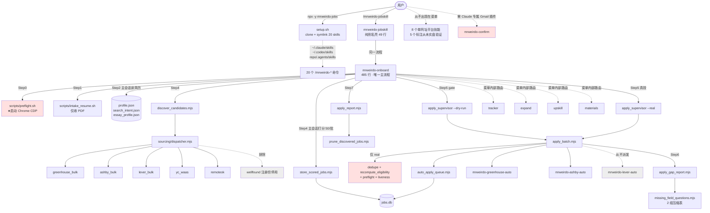

# 架构与上手路径现状报告 — Mr. Weirdo Jobs

> 说明一：本报告只盘点、不改任何现有文件，不做产品优先级排序（那是 pm 并行在做的事）。
> 说明二：引用他人文档原文时，被项目术语表禁用的旧词已统一替换成现行正名（投递 / 岗位 / 用户），语义未改。
> 说明三：本次真跑过的只读命令 —— 沙箱全新安装 `setup.sh`、`npm run demo:check`、`doctor --install-check`、`apply_supervisor --dry-run`、`queue_diagnostics --json`、`recompute --json`（无 --apply）、`npm run status`、`npm test`、只读查本机 jobs.db。**没有投出任何一条、没有发任何邮件、没有提交任何表单。**

---

# 第一部分 · 给拍板人（不涉及代码）

## 1. 现在这东西实际是什么

一句话：**它是一套装在你自己电脑上的求职流水线，能真的把简历投出去——但目前只对两家投递平台真正管用，而且必须在"正确的文件夹里"启动才不会当场散架。**

拆开看，装完之后你的电脑里多了 20 个命令（技能）。这 20 个的真实成色差别极大：

| 分类 | 数量 | 真实状态 |
|---|---:|---|
| 给你用的主入口 | 2 | `/mrweirdo-jobskill` 和 `/mrweirdo-onboard` 是**同一个东西的两个名字**，一个是另一个的壳 |
| 真正跑通过、有实盘记录的自动投递 | 2 | Greenhouse、Ashby（本机 182 条成功投递都来自这两家） |
| 手动单个网址投递（你自己点提交） | 3 | Greenhouse / Ashby / Lever |
| **文件里明确写着"从未实盘验证过"的平台** | 5 | iCIMS、JobVite、Handshake、SmartRecruiters、Workday |
| 辅助工具（体检、跟进、写材料、技能缺口等） | 8 | 能跑，但其中"读确认邮件"那个在你的运行环境里装不上（见下） |

所以「这东西是什么」的诚实版本是：**一台双缸发动机（Greenhouse + Ashby），外面挂了 5 个从没点过火的备用缸，还有一层名字很多、彼此重叠的外壳。**

## 2. 关于「folder 看起来很乱」——乱的其实不是文件夹

7 月 22 号那一轮规整已经把仓库目录理干净了（死代码隔离、文档三线制、垃圾清除），我复查确认那一轮的结论仍然成立。**你现在感觉到的乱，来自另外四件事：**

1. **一屏 20 个命令，你分不清哪个能用。** 名字长得都一样（`/mrweirdo-xxx`），但里面 5 个是没验证过的空壳、2 个是同一件事、3 个是给机器内部调用的引擎（不该出现在你眼前）。
2. **同一个问题有三个数字，而且互相矛盾。** 「我还剩多少个岗位能投」这一个问题，系统在三个地方给你三个答案：看板说 **562**、诊断说 **215**、真正投的时候只有 **18**。这一条最伤信任——我在第 5 节给出了准确原因，它跟之前的诊断不完全一样。
3. **文档写的和代码做的对不上。** 举三个都被我实测证实的：免责声明说「约 25 家大公司默认跳过、保护你的名额」——**默认安装下这个保护是空的、一家都没保护**；免责声明说「解析结果要你确认后才开始找岗」——这道确认门在 6 月 13 号那次改版里已经取消了；架构文档说接了 6 个找岗来源——实跑只有 5 个。
4. **你每天打开的那个状态文件夹 `~/.mrweirdo-jobs/` 没人清过。** 里面躺着 `BUGS-from-onboard-run.md`、`HANDOFF-continue-applications.md`、`NEXT-SESSION-TODO.md`、三个旧 shell 脚本和一个 `demo/` 目录——全是历史残留。上一轮规整只清了代码仓库，没清这里。

## 3. 从零上手会经历什么（我真的走了一遍）

**能走通的部分（实测通过）**：在一个全新的沙箱目录里跑安装脚本，从 GitHub 拉代码、把 20 个技能挂进 Claude Code 和 Codex、建好本地目录、自检 11 项全绿——**安装这一环是健康的，不用改。**

**然后你会撞上的东西，按顺序：**

**第 1 步 · 敲 `/mrweirdo-jobskill`** —— **这里有一个会当场死掉的坑。**
主入口的操作说明里有 9 处「先切到代码目录再执行」，但**它从来没告诉电脑那个目录在哪**。如果你是按 README 说的那样、在自己的家目录里打开 Codex，那么第一条命令就会返回一句 `No such file or directory` 然后停住——错误信息里没有任何一个字提到真正的原因。（我实测复现了：退出码 127。）
反讽的是，那 9 个「不重要的」单网址技能每一个都写了这行兜底，**唯独主入口漏了**。

**第 2 步 · 还没要你的简历，先弹出一个 Chrome 窗口。**
流程的第一件事是启动一个专用浏览器。这在逻辑上没必要（找岗和读简历都不需要浏览器，只有真投的时候才需要），但它排在最前面，而且**一旦浏览器起不来，整个流程就停在这一步**，你连简历都还没交。

**第 3 步 · 「上传简历」其实不是上传。**
系统会说「发我简历 PDF 的绝对路径」——你得自己知道文件在电脑上的完整位置并手打出来。Codex 里没法拖文件进去。另外只收 PDF：给个 Word 文档会直接顶回来说「不是 PDF」，**不告诉你该怎么转**。

**第 4 步 · 问你 3 个选择题**（工作授权 / 地点 / 法律声明），这一步体验是好的，一次问完。

**第 5 步 · 找岗 + 打分**，5～15 分钟，只读不投，这一段设计是对的。

**第 6 步 · 投递确认门**：给你看一张队列表，你回「开始」才真投。这是全流程做得最好的一处。

**第 7 步 · 投完之后**才问你补信息。

**全程你要动手几次**：打简历路径 1 次、答硬边界题 1 次、（可能）追问 1 次、确认门回「开始」1 次、批后补信息 1 次 ＝ **4～5 次**。这个数字本身是达标的（原 PRD 的目标是 ≤3 次输入）。
**但还要加上权限弹窗**：仓库里有一份预授权清单（21 条），本意是让你少点 10 几次「允许」。我核查后确认：**这份清单在你的运行环境（Codex）里完全不生效**——它是 Claude Code 专用格式，而且只有在「Claude Code 恰好是从代码仓库那个目录打开的」时候才算数。所以实际体感是：一路狂点允许。

**会静默卡住 / 你看不懂发生了什么的地方**（详细清单在第二部分）：目录变量丢失只报一句莫名其妙的错、读不到你的求职意向文件时系统会**默默假装你要找实习**继续跑下去而不报警、确认门看到的队列和真跑的队列不是同一份。

## 4. 你期望的 5 步，各自到哪了

| 你的原话 | 判定 | 差在哪 |
|---|---|---|
| **1. 安装后可以上传简历** | 🟡 部分实现 | 装得上（实测通过）；但不是「上传」，是**手打文件绝对路径**，且只收 PDF。入口在非代码目录启动会当场挂掉。 |
| **2. 读简历，并根据简历内容向他提问（比如每个投递需要的不同基础信息）** | 🟠 实现了但和你想的不一样 | 顺序是反的：**先问 3 个写死的固定问题，之后才读简历**。而「每个投递需要的不同基础信息」这层确实存在、也确实是从真实表单反推的——但它**发生在第一批真投递之后**，不是投递之前。 |
| **3. 结合简历生成定制化问题让他回答** | 🔴 基本没有 | 规则上只允许两种追问（简历里有多个方向 / 资历信号混杂），最多 3 问。更要命的是：**简历分析确实会生成一批定制问题并存进文件里，但全仓库没有任何一行代码或说明会去读它**——生成完就烂在那，永远不会问你。 |
| **4. 总结回答，生成用户画像** | 🟡 实现了但你看不见 | 画像确实生成了（三个文件），但你只在流程中间看到一张 7 行的表格一闪而过，**之后没有任何地方能回看「我的画像长什么样」**，也不能修改。 |
| **5. 问他想找什么工作 → 找岗 → 投递** | 🟡 部分实现 | 「想找什么工作」是**可选的一句话**，系统从不主动明确问你；找岗环节完整（5 个来源）；投递只覆盖 2 个平台；而「还剩多少能投」的读数有三套互相矛盾的口径。 |

### 关于「问题集从真实表单反推并压缩」这条老设计原则

**核实结论：原则在，落地约六成。**

- ✅ **真的是从真实表单反推的**，不是拍脑袋列的清单——系统会把每次真投递时表单上蹦出来的字段收集起来，归类成 12 个类目。
- ✅ **真的按「补这条能解锁几个岗位」排序**，而且是去重后的岗位数，不是字段出现次数。
- ⚠️ **「压缩」这一层是人手写死的 2 组**（地址物流类、合规声明类），只合并了 12 个类目里的 5 个；剩下 7 个类目仍然是一类一问。所以现状是「12 个原始类目 → 最多 9 个问题」，离你要的「ABCDEFG → XYZ」还有距离，而且这张合并表不会随着真实表单的变化自己长大。
- ⚠️ **时机不对**：整套智能只在「第一批真投递之后」触发。所以用户在投出去之前，完全体验不到这层压缩。

## 5. 「还剩多少能投」三个数字互相矛盾——准确原因（重要，修正了之前的诊断）

你在三个地方会看到三个数：

| 你在哪看到 | 数字 |
|---|---:|
| 实时看板顶栏 | **562** |
| 系统诊断的「合格数」 | **215** |
| 真按下投递时的队列 | **18** |

之前那一轮的结论是「字段只在真跑批时才刷新，重跑一下就好了」。**我实测下来这个结论只对了一半，而且关键那一半是错的**：我把刷新程序跑了一遍（只算不写），结果是**放行 0 行、收回 1 行**——**重跑刷新解决不了任何问题。**

真实原因是：系统里有一条安全守卫，**凡是打分记录里缺「推荐与否」这个结论字段的岗位，一律不许自动投**。查你本机数据库：待投的合格岗位里有 **244 行**没有这个字段，全部是 5 月 26 日到 6 月 12 日之间入库的；6 月 10 日之后入库的 20 行才有。也就是说 **6 月中旬打分程序升级过一次，升级前的存量全部被这条守卫扣住了。**

而「215」这个数字是另一段代码算的，**它算的时候不带这条守卫**——所以两边永远对不上。

**这意味着什么（人话）**：那两百多个岗位不是「忘了刷新」，是「用旧标准打的分，新系统不认」。要么给它们**重新打一次分**，要么**明确决定放宽这条守卫**。这是个需要拍板的取舍，不是一个可以顺手修的 bug——我把它标出来，供 pm 排序时用。

## 6. 你写过、但没被实现（或已被悄悄改掉）的需求

完整逐条清单在第二部分第 5 节（含原文摘录 + 出处路径）。这里先说最扎眼的五条：

1. **「大公司名额保护」写在免责声明里，默认安装下是空的。** 声明说约 25 家大公司（含 Google、Meta、OpenAI 等）默认跳过、保护你有限的投递名额。实际代码是：找一个用户自己建的名单文件，**找不到就返回空名单**。安装脚本不生成这个文件，你本机也没有。→ **默认状态下这层保护等于不存在。**
2. **「解析结果要你确认后才开始」这道门已经取消了，但免责声明还在承诺它。** 免责声明两处写着这是你「抓住简历错别字的机会」。2026-06-13 的改版把它降级成了「给你看一眼但不等你回」。法律文件描述了一个不存在的安全网。
3. **每日投递上限没有任何代码在执行。** 你已经拍板「先 20-30 条/天」。代码里：投递数只写进一个日志文件，**全仓库没有任何一行去读它**；看板上显示的 `0/50` 是个写死的展示数字，不管事。而主入口的默认行为是「把所有合格的行一次投完」。
4. **「读确认邮件、闭合回路」在你的运行环境里装不上。** 那个技能要求装 Claude 专用的 Gmail 插件 + 你手动在 Gmail 里建一条过滤规则。**Codex 没有这个插件。** 这解释了竞品调研里那个最刺眼的发现——183 条投递、确认回执数为 0：不是没人回，是**这条腿从来没接上过**。
5. **「问题集必须从真实表单反推压缩」这条你亲自定的核心原则，落地了六成**（见上一节）。

## 7. 工程上最该先动的三处（不是优先级排序，是止血顺序）

**A. 让主入口在任何目录下都能启动，并且把浏览器挪到后面。**
现在的状态是：一个新用户按你的说明书操作，**第一条命令就死**，而且错误信息完全不指向真因。这一条不修，其他所有讨论都是空谈——因为没人能走到第二步。工作量小（改 9 处路径 + 1 处顺序）。

**B. 把「还剩多少能投」统一成一个口径，并把被扣住的 244 行摆到明面上。**
现在三个数字互相矛盾，而真正的原因（旧打分缺字段）**没有任何界面告诉用户**。至少要做到：用户看到的那个数字就是真能投的数字，被扣住的行明确显示「被扣住的原因 + 怎么解开」。

**C. 让默认安装兑现免责声明里已经承诺的安全底线。**
大公司名额保护默认为空这件事，风险是真的落在用户的名额上（一次投掉一个 Google 名额）。要么让安装脚本生成默认名单，要么改掉免责声明的措辞。**两者选一，但不能维持现状。**

---

# 第二部分 · 给技术

## 1. 目录与模块职责现状

```
mrweirdo-jobs/
├── bin/mrweirdo-jobs.mjs        npx 入口 → 只做一件事：spawn setup.sh
├── setup.sh                     安装器（9 步：环境检查 → clone → 挂技能 → 建目录 → 哨兵 → doctor → 欢迎语）
├── .claude/skills/  (20 个)     技能层：说明书 + bash 编排，无业务逻辑
├── shared/          (69 个平铺) 执行层：驱动 / 队列 / 打分入库 / 报告 / 体检
│   ├── sourcing/                找岗层：dispatcher + 各平台看板 API
│   │   ├── _unwired/  (6 个)    明确未接线（7-22 规整产物，规则清晰）
│   │   └── _executors/(1 个)    技能直接调用的执行器，单文件目录，意图不明（沿用 7-22 的 UNCLEAR-7）
│   ├── scoring/ intelligence/ references/  纯提示词与 schema 资产
│   └── workday/companies/       全是模板与占位文件，无真实租户配置
├── scripts/         (8 个)      安装/演示/门禁/看板等运维脚本
├── test/            (32 个)     128 个用例，本次实跑 **128 pass / 0 fail**
└── docs/                        三线制（根=现行 / active=过程 / archive=退役），本轮复查仍成立
```

**规模与红线**：`shared/` 平铺 69 个文件（7-22 判「本轮不动」，结论仍有效）。3 个文件超 800 行红线，按 `.claude/file_size_limits.json` 处于「只减不增」：`greenhouse_apply_driver.mjs` 1917 行、`ashby_helpers.js` 1243 行、`ashby_apply_driver.mjs` 1170 行。

**违反 7-22 定的「代码只有两种状态」规则的两个文件**（既不是接线的、也没进 `_unwired/`）：
- `shared/sourcing/handshake_search.mjs` — v0.6 stub，dispatcher 的 ADAPTERS 里根本没注册，只有一个技能文档里提了一句。
- `shared/sourcing/wellfound_search.mjs` — 在 ADAPTERS 里注册了（`dispatcher.mjs:87`），但被 `DEFAULT_SOURCES` 注释排除（`dispatcher.mjs:118`），且函数本身是被 DataDome 挡住的 stub，永远返回空数组。
→ 直接后果：`docs/ARCHITECTURE.md:110-113` 写「Six sources are wired in」，实跑 `discover_candidates.mjs --plan` 输出的 sources 只有 5 个。

## 2. 调用流（技能调用关系图）



**关键结构事实**：
- 唯一真流程是 `mrweirdo-onboard`（485 行）；`mrweirdo-jobskill` 只是 49 行的别名壳（`mrweirdo-jobskill/SKILL.md:8-10`）。
- 用户菜单只暴露 5 项；8 个单网址技能 + 3 个 `-auto` 引擎 + doctor/confirm/cherry-pick 都属「内部路由」，但它们**在 Codex / Claude Code 的命令列表里照样一个不少地显示给用户**——菜单纪律只约束了模型的输出，约束不了命令面板。
- `-auto` 引擎三个里 `mrweirdo-lever-auto` 永不被派发（`lever` 不在 `SUPPORTED_AUTO_PLATFORMS`）。

## 3. 断点与风险（按严重度，全部带 file:line，均已实测）

### B1 主入口的目录变量从不设置 —— 首跑必挂 🔴
- `.claude/skills/mrweirdo-onboard/SKILL.md` 第 126/152/194/246/296/326/371/425/445 行共 9 处 `cd "$MRWEIRDO_REPO_ROOT"`，**全文无一处 export / 定义该变量**。
- 对照：9 个单网址技能全都有兜底，例如 `mrweirdo-lever/SKILL.md:64`、`mrweirdo-confirm/SKILL.md:23-24`（后者甚至有目录不存在时的二次回退）。
- `shared/paths.mjs:18` 的注释仍写着「SKILL.md files set `MRWEIRDO_HOME` + `MRWEIRDO_REPO_ROOT` env at top」——**这个契约被主入口在某次重写中悄悄丢掉了，注释没跟上。**
- 实测：`env -u MRWEIRDO_REPO_ROOT bash -c 'cd "$MRWEIRDO_REPO_ROOT"; bash scripts/preflight.sh'` → `bash: scripts/preflight.sh: No such file or directory`，退出码 127。
- **放大器**：bash 里 `cd ""` 返回 0 且不换目录，所以第一条 `cd` 静默成功、后面的 `node shared/xxx.mjs` 抛裸 Node 堆栈。用户与模型都很难反推到真因。

### B2 Step 0 先启动浏览器，而且是硬阻断 🔴
- `scripts/preflight.sh:24-27`：CDP 探测不通就直接调 `chrome-cdp-launcher.sh`。
- `SKILL.md:130`：`Stop on any failure and tell the user what to fix.`
- 后果：在无法开 GUI 的沙箱 / 远程会话里，用户在**交出简历之前**就被挡死；而找岗与打分这两段（占全流程 80% 时间）根本不需要浏览器。
- `chrome-cdp-launcher.sh:96-101` 已经写了「沙箱起不来请去可见终端跑」的提示，说明这个坑被踩过，但补救方式是让用户自己去开终端。

### B3 「还能投多少」三套口径 🔴
| 出处 | 口径 | 本机实测 |
|---|---|---:|
| `scripts/dashboard.mjs:160` | 已打分待处理行 | 562 |
| `shared/queue_diagnostics.mjs:160` | `reason === 'eligible'`，**不带 legacy 守卫** | 215 |
| `shared/auto_apply_queue.mjs:61` | 以存量列 `auto_apply_eligible = 1` 为前置条件，再叠加平台 / 配额 / 可信度 / 存活性 / 同公司同岗位去重 / 职能相关性等过滤后的**最终队列** | **18**（`apply_supervisor --dry-run` 实测行数） |

- 真因在 `shared/recompute_auto_apply_eligibility.mjs:81-83`：
  `if (reason === 'eligible' && row.recommended == null && currentEligible === 0) reason = 'legacy_recommended_unknown';`
  → 本机命中 **197 行**（18 + 197 = 215，与诊断口径严丝合缝）。
- DB 实查（只读）：待投 `fit_score >= 5` 的行中 `recommended IS NULL` 共 **244 行**，创建区间 2026-05-26 ～ 2026-06-12；`recommended = 1` 仅 20 行，区间 2026-06-10 ～ 06-21。`recommended` 的定义在 `shared/scoring/score_prompt.md:65`，是 6 月中旬那版打分提示词才引入的。
- **修正 `docs/specs/next-priorities.md` 的诊断**：不是「字段只在跑批时刷新」。跑批时**确实**会刷新（`apply_batch.mjs:226` 在 `!dryRun` 分支里调 recompute），但我实跑 `recompute --json`（未 --apply）结果是 `enable: 0 / disable: 1` —— **刷新解决不了，被守卫扣住的行刷新后依然不放行。** 出路只有两条：重新打分补齐 `recommended`，或改守卫策略。这是取舍，不是修 bug。

### B4 确认门看到的队列 ≠ 真跑的队列 🟠
- `shared/apply_batch.mjs:219-231`：`dedupe_jobs` + `recompute_auto_apply_eligibility` + `supervisor_preflight` + `liveness_gate` 全部包在 `if (!dryRun) { ... }` 里。
- 即 Step 5 的 `--dry-run` 预览跑的是**未去重、未重算、未做存活性检查**的队列；用户点头之后的 `--real` 才补做这些。
- 今天的实测差异是 1 行（`julius / Growth Intern` 会被 dedupe 掉），影响小；但**差异方向和幅度没有任何保证**——用户同意的清单和实际执行的清单不是同一份，这是同意机制上的结构性瑕疵，不是数据巧合。

### B5 大公司名额护栏默认为空 🟠（安全承诺与实现不符）
- `shared/paths.mjs:75-82`：`loadCompanyList()` 找不到 `~/.mrweirdo-jobs/company_list.user.json` 就返回 `{ companies: [] }`，注释明写「deliberately no bundled default company list」。
- `setup.sh` 不生成该文件；本机 `~/.mrweirdo-jobs/` 里也没有；仓库里只有 `examples/example_company_list.json`，内容是一家「Example Startup」。
- 但 `DISCLAIMER.md:53` 与 `README.md:104-105` 都把「约 25 家大公司默认跳过」当作已生效的内建缓解措施陈述。
- → **默认安装下 `apply_quota_limit` 恒为 null，配额护栏对任何公司都不生效。**

### B6 免责声明描述了一道已被拆除的确认门 🟠
- `DISCLAIMER.md:26`：用户必备动作含「(c) explicitly confirming the parsed profile/search intent before discovery and auto-apply begins」。
- `DISCLAIMER.md:40`：「The explicit parse-confirmation step after resume parsing is your chance to catch this before the run starts.」
- 实际：`SKILL.md:231` 明写 `Do not wait for a separate parse confirmation.`（2026-06-13 的软窗口改版，`docs/archive/PRD-v3.md:83` 是决策出处）。
- 同处小漂移：`DISCLAIMER.md:17` 说「a short ABCD questionnaire」（4 问），实际是 A0/A1/A2 三问（`references/intake-and-profile.md:10-14`）。

### B7 每日投递上限无任何代码执行 🟠
- `shared/apply_batch.mjs:374` 把每次成功投递写进 `daily_count.jsonl`；全仓库 grep：**只有这一处写，零处读**。
- `scripts/dashboard.mjs:35` 的 `const DAILY_CAP = 50;` 是纯展示常量，且与已拍板的「20-30 条/天」不一致。
- `mrweirdo-jobskill/SKILL.md:37-38` 默认「process every currently eligible queued row」。
- 节奏 `apply_batch.mjs:37-38` 为 30–90 秒/行 → 若守卫放开、215 行一次投完 ≈ **3.6 小时前台连续运行**。

### B8 Gmail 回执闭环在声明的运行环境里装不上 🟠
- `.claude/skills/mrweirdo-confirm/SKILL.md:12` 前置条件写死「Claude Code 已连 Gmail MCP（`mcp__claude_ai_Gmail__*`）」，外加用户手建 Gmail 过滤规则。
- Codex 无此插件 → 这条腿在拍板人声明的运行环境里从未可用。
- 与 `docs/specs/competitor-research.md` 的「`confirmed_at` 全 0、183 条投递零回音」互为因果：**不是没测出来，是测量装置从来没装上。**

### B9 预授权清单在实际使用场景里失效 🟡
- `.claude/settings.json` 有 21 条精确前缀白名单（`docs/archive/PRD-v3.md:155` 的产物，目的是把权限弹窗从 10-15 次压到 2 次）。
- 两个失效条件：① 它是**项目级**配置，只在 Claude Code 的工作目录 = 本仓库时生效；而 README 的指引是「装完在 Claude Code 或 Codex 里敲命令」，不含任何 cd 指示。② **Codex 不读 `.claude/settings.json`**；Codex 侧配置只有 `agents/openai.yaml`，且只有 `mrweirdo-onboard` 和 `mrweirdo-doctor` 两个技能带。
- → 拍板人的实际运行环境里，那 21 条预授权一条都不生效。

### B10 静默降级（违反 fail-fast）🟡
- `shared/auto_apply_queue.mjs:22-28`、`shared/queue_diagnostics.mjs:19-25`、`shared/recompute_auto_apply_eligibility.mjs:17-23` 三处 `readIntent()` 在读不到 `search_intent.json` 时静默 `return { search_intent: { seniority: 'intern' } }`。
- 实测佐证：在无 profile 的全新沙箱里跑 `discover_candidates.mjs --plan`，输出 `"ok": true` 且 `role_type_targets: ["intern"]` —— **用户意向文件缺失时系统自己编了一个意向继续跑，不报警。**

### B11 其他一致性缺口 🟡
- **Notion 三处口径打架**：`shared/paths.mjs:131-155` 三个 `notion*` 函数零调用（残留）；`README.md:183` 写「Notion 可选、默认关闭」；`docs/ARCHITECTURE.md:155` 写「已彻底移除、无任何受支持的镜像方式」。
- **临时目录全机共享**：`/tmp/mrweirdo-onboard` 不按人隔离（`shared/onboard_tmp.mjs`），同一台机器上两个人会互踩。
- **`setup.sh:197`** 的参考命令块把状态目录硬编码成 `~/.mrweirdo-jobs/...`，与同一脚本支持的 `MRWEIRDO_HOME` 覆盖不一致；同一行还混着中英文残句。
- **`setup.sh:168`** 欢迎语仍写「Drop your resume PDF **and** a short self-introduction」，与 `docs/archive/PRD-onboarding-ux.md` §5.2 已拍板的「自我介绍降级为可选」不一致；`README.md:50` 同样问题。

## 4. 「问题集从真实表单反推压缩」的实现深度（逐层核实）

| 层 | 实现位置 | 状态 |
|---|---|---|
| 采集：从真实投递结果里收表单字段 | `shared/apply_gap_report.mjs`（读 `apply-result-*.jsonl`） | ✅ 真的从真实表单来 |
| 归类：字段标签 → 类目 | `apply_gap_report.mjs:181-241`，12 个 `user_*` 类目 | ✅ 存在（正则匹配，脆弱性见 PRD R1） |
| **压缩：类目 → 最小用户问题集** | `shared/missing_field_questions.mjs:1-35` | ⚠️ **仅 2 组手写合并表**，覆盖 5/12 类目；其余 7 个走 `:160-172` 的 singleton 分支＝一类一问 |
| 排序：按解锁岗位数 | `missing_field_questions.mjs:116,147`（distinct row_id 去重） | ✅ 符合 PRD §5.4 计数正确性要求 |
| 不变量守卫 | `missing_field_questions.mjs:174-178`（覆盖率断言） | ✅ 工程上做得好 |
| 触发时机 | `SKILL.md:382-419`（Step 6，真投递之后） | ⚠️ 投递前完全体验不到 |
| 简历派生的定制问题 | `essay_profile.template.json:73` 的 `dynamic_questions_to_ask_later` | 🔴 **写入后零消费**：全仓库仅 3 处提及，全是「要生成它」的说明，**无任何读取方** |

**结论**：核心设计原则没有被违反（不是固定问卷、不是逐岗位问），但「压缩」这一层目前是静态 2 组表，不会随真实表单分布生长；且整层智能只在首批投递之后启动，与拍板人期望的「投之前就问清楚」在时序上错位。

## 5. 用户写过、但可能被忽略的需求（逐条：原文摘录 + 出处 + 现状）

> 摘录中被术语表禁用的旧词已换成现行正名，语义未改。

| # | 原文摘录 | 出处 | 现状 |
|---:|---|---|---|
| 1 | 「本产品唯一的核心功能 = 一键/一句话自动投递……**简历是用户唯一必须提供的输入**」 | `docs/archive/PRD-onboarding-ux.md` §2 | 🟡 简历确实是唯一必填，但「一句话」前还夹着启动浏览器 + 手打绝对路径 |
| 2 | 「问什么**从真实投递归纳压缩而来**，不是钦定的固定清单；把一长串原始字段(ABCDEFG)上卷成最小问题集(XYZ)」 | 同上 §3 G3 / §5.3 | ⚠️ 落地约 60%，压缩层是静态 2 组表（见第 4 节） |
| 3 | 「**反模式（严禁）**：今天投 A 看到要 ABC 就问 ABC，明天投 B 看到要 BCD 就问 BCD……每次现问现填」 | 同上 §5.3 | ✅ 未违反：跨批次统一归类 + 去重排序 |
| 4 | 「极少数字段（如工作地点、是否需要 sponsorship）必须在找岗**之前**知道……**同样遵循『能合并就合并、不声明固定清单』的原则**」 | 同上 §5.3 末段 | 🔴 **违反**：A0/A1/A2 就是一张写死的固定表（`references/intake-and-profile.md:10-14`），且在读简历之前问 |
| 5 | 「缺失信息……按『能解锁多少个 distinct 岗位』降序呈现」 | 同上 §5.4 | ✅ 已实现（去重计数正确） |
| 6 | 「开放题……在任何向用户提问之前，**先由 agent 自动起草**」 | 同上 §5.5 | ✅ 规则在 `SKILL.md:391-393` + `references/run-and-database.md:134-140` |
| 7 | 「**绝不预设任何职能/方向**——尤其不能 hard-code PM / growth / startup 假设」 | 同上 §2 | ✅ 已落到打分提示词 `score_prompt.md:86` 与 `intake-and-profile.md:31-35` |
| 8 | 「不相关岗位……**即便偶然分数不低，也不进自动投队列**」 | 同上 §5.7 | ✅ `shared/function_relevance.mjs` + 本机实测拦下 72 行 |
| 9 | 「用户全程必须『打字』的地方 = **仅简历 PDF 路径**」 | 同上 §10 验收 | 🟡 达标，但那一次打字要求用户自己知道绝对路径 |
| 10 | 「入口/任何菜单**永不出现** `/mrweirdo-greenhouse\|ashby\|lever` 等平台命令」 | 同上 §10 | ⚠️ 模型输出层做到了；但命令面板里 20 个技能照常全列，`setup.sh:189-198` 的安装尾屏还主动列了 6 个平台命令 |
| 11 | 「首跑 happy path：用户输入 ≤3 次、**权限弹窗 ≤2 次**、最长静默 ≤15s」 | `docs/archive/PRD-v3.md` §4.1 | 🔴 权限指标在 Codex 下不成立（B9）；输入次数实际 4-5 次 |
| 12 | 「`--real` 与 `retry_gap_rows.mjs --apply` **不得进 allowlist**」 | 同上 §8 硬约束 2 | ✅ 已遵守（`.claude/settings.json` 已核对） |
| 13 | 「保留投递前唯一确认门 + truthfulness」 | `docs/PRD-improvements.md` §2 | ✅ 门在（`SKILL.md:321-366`）；⚠️ 但门里看到的队列与真跑队列不同源（B4） |
| 14 | 「单行缺信息只跳过该行，**绝不中止整批**」 | 同上 §3 G1/G2 | 🟡 部分：record 失败已 continue；但本机 skip 分布里 `stuck_on_same_missing` 仍 13 例、`profile_specific_answer_required` 5 例 |
| 15 | 「把 Lever 加进 `SUPPORTED_AUTO_PLATFORMS`（一行改动，免费解锁）」 | 同上 §3 G3 | 🔴 未做；`mrweirdo-lever-auto` 引擎完整存在但永不被派发 |
| 16 | 「约 25 家大公司默认跳过自动投，保护每周期的硬性投递名额」 | `DISCLAIMER.md:53`、`README.md:104` | 🔴 **默认安装下为空**（B5） |
| 17 | 「(c) 在找岗和自动投开始前**显式确认**解析出的画像/意向」 | `DISCLAIMER.md:26,40` | 🔴 该门已于 2026-06-13 降级为软窗口（B6） |
| 18 | 「默认节奏 30–90 秒/次提交」 | `DISCLAIMER.md:65` | ✅ 与 `apply_batch.mjs:37-38` 一致 |
| 19 | 「不重试失败的提交。一行只投一次，避免重复投递」 | `DISCLAIMER.md:85` | ⚠️ 措辞与 `retry_gap_rows.mjs` 的补信息后重投路径存在解释空间，建议措辞澄清 |
| 20 | 「**每日投递上限：先小步跑 20-30 条/天**」 | `docs/active/2026-07-23_next-priorities_TASK.md` 关卡 1 拍板 | 🔴 零代码执行（B7） |
| 21 | 「不做独立看板——总结做成 skill 跑完后自然给出的一份 summary」 | 本任务 TASK Round 1 拍板 | ⚠️ 现状相反：`npm run status` 是一个独立常驻 TUI 看板，且 `SKILL.md:280` 主动引导用户去开它 |
| 22 | 「历史 183 条投递不救，只管以后」 | 同上关卡 2 拍板 | ✅ 本报告未提出任何历史挽回动作 |
| 23 | 「用户尚未成功跑通真实 iCIMS / JobVite / Handshake 提交」 | 三个 helper 文件头注释（如 `shared/icims_helpers.js:6`） | ✅ 事实陈述仍准确，但 `README.md:125` 把它们列进「Supported Platforms」表，措辞过于乐观 |
| 24 | 「`shared/` 平铺分组重构本轮不做，要做需单独立项 + 全量回归」 | `docs/specs/project-cleanup.md` | ✅ 本报告不建议现在动它 |

## 6. 改进方案（分步、每步可独立拍板，不含优先级排序）

> 每步都写了「不做会怎样」，方便 lead/pm 单独取舍。全部为方案，本次不改任何文件。

**S1 · 主入口路径自愈**（对应 B1）
在 `mrweirdo-onboard/SKILL.md` 的第一个 bash 块加 3 行环境兜底（与 `mrweirdo-confirm/SKILL.md:23-24` 完全同款，已在 9 个技能里验证过），并同步修正 `shared/paths.mjs:18` 的过期契约注释。
*不做会怎样*：所有不在仓库目录里启动的新用户，第一条命令必挂且错误信息误导。

**S2 · 浏览器启动后移**（对应 B2）
把 CDP 检查从 Step 0 挪到 Step 5 真投之前；Step 0 只留 Node 版本 + 目录 + doctor 的非 CDP 部分。
*不做会怎样*：无 GUI 环境的用户在交简历前就被挡死；有 GUI 的用户也要先被弹一个莫名其妙的浏览器。

**S3 · 单一 eligible 口径 + 把被扣住的行摆上台面**（对应 B3，**含一个需拍板的取舍**）
① 让 `queue_diagnostics` 与 `auto_apply_queue` 共用同一段判定（消除 215 vs 18）；② 在诊断与看板里新增一行 `legacy_recommended_unknown: N（原因：旧版打分未产出 recommended 字段）`；③ **取舍点**：这 244 行是重新打分（花模型 token、约 5 批）还是放宽守卫（有误投风险）——请 pm / 拍板人定，工程两条路都能走。
*不做会怎样*：三个数字继续互相矛盾，任何关于「投得少」的讨论都建立在错误数字上。

**S4 · 确认门与真跑同源**（对应 B4）
把 `dedupe` + `recompute` 的**只读版**也接进 `--dry-run` 分支（只算不写），让确认门展示的行集合＝真跑的行集合。
*不做会怎样*：用户同意的清单与实际执行的清单可能不一致，同意机制存在结构性瑕疵。

**S5 · 兑现或撤回大公司护栏承诺**（对应 B5，**二选一需拍板**）
A：`setup.sh` 生成一份内置默认 `company_list.user.json`（约 25 家）；B：改 `DISCLAIMER.md:53` 与 `README.md:104` 的措辞为「需用户自行配置」。
*不做会怎样*：默认安装下会把大公司的稀缺投递名额烧掉，而免责声明声称已保护。

**S6 · 免责声明与实现对齐**（对应 B6）
修正 `DISCLAIMER.md:17/26/40/85` 四处（问题数量、解析确认门、重试措辞），使对外文件不再描述已拆除的安全网。
*不做会怎样*：对外文件承诺了不存在的保护，风险敞口在拍板人自己身上。

**S7 · 每日上限入代码**（对应 B7）
读 `daily_count.jsonl` 做真实拦截，默认值取已拍板的 20-30；`dashboard.mjs:35` 的展示常量改为读同一来源。
*不做会怎样*：已拍板的账号风险控制线纯靠人记得敲环境变量。

**S8 · 回执闭环换一条能在 Codex 跑的路**（对应 B8，**需拍板方向**）
现有 Gmail MCP 方案在声明的运行环境不可用。可选方向：本地 IMAP 只读，或先做「投递后 N 天手动标记」的降级闭环。**竞品调研已指出「谁先测出回复率谁才有资格谈定位」，这一步不通，主指标就永远测不出来。**
*不做会怎样*：`confirmed_at` 永远是 0，产品无法自证有没有用。

**S9 · 命令面暴露面收敛**（对应「为什么还觉得乱」第 1 条，**需拍板**）
20 个技能里有 5 个从未实盘验证、3 个是内部引擎。可选：把未验证的 5 个移出默认安装（或改名加前缀不挂载），`-auto` 引擎不挂进用户技能目录。
*不做会怎样*：用户面对一屏无法分辨成色的命令，这是「看起来很乱」的主要来源之一。

**S10 · 一致性回归纳入门禁**（对应 B11 与历史反复出现的文档漂移）
把「文档声称 vs 代码实际」的几条硬事实（源数量、支持平台、护栏是否有数据、确认门是否存在）做成 `demo:check` 的断言项。
*不做会怎样*：这类漂移在 6 月、7 月已各出现一轮，靠人肉复查会继续复发。

**S11 · 两个「不上不下」的模块归位**（对应第 1 节）
`handshake_search.mjs` 与 `wellfound_search.mjs` 二选一：接线或移进 `_unwired/`，并同步修正 `ARCHITECTURE.md:110-113` 的「6 个源」。
*不做会怎样*：7-22 刚立的「代码只有两种状态」规则出现例外，规则一旦破例就会继续破。

## 7. Anything UNCLEAR（需要知情人补答，我不猜）

1. **244 行旧打分记录怎么处置？** 重新打分（成本：约 5 批模型调用）还是放宽守卫（风险：这些行当初就没通过新版推荐标准）——这是产品取舍，我只能给出两条路的工程代价。
2. **拍板人说的「folder 很乱」具体指哪个 folder？** 我按两处都盘了（代码仓库 + `~/.mrweirdo-jobs/` 状态目录）。若指的是后者，那么本次真正该清的是状态目录里的历史残留，而不是代码结构。
3. **`shared/sourcing/_executors/` 单文件目录的意图**（沿用 7-22 的 UNCLEAR-7，至今无人作答）：是有后续扩展计划，还是历史残留？影响后续要不要把它并回去。
4. **「skill 跑完自然给出一份 summary」与现存的常驻 TUI 看板（`npm run status`）是什么关系？** 是替换掉看板、还是并存？`SKILL.md:280` 目前会主动引导用户去开看板，与「不做独立看板」的拍板方向相反，需要澄清后才能定改法。
5. **Codex 侧的权限模型是什么？** 我只能确认 `.claude/settings.json` 是 Claude Code 专属格式、且 Codex 侧仅有两个 `agents/openai.yaml`。Codex 是否有等价的预授权机制、拍板人实际用的是哪个版本的 Codex——需要补一句，否则 S1/S9 的具体做法无法定死。
6. **`DISCLAIMER.md:85`「不重试失败提交」与 `retry_gap_rows.mjs` 补信息后重投**，是当初有意的例外，还是措辞疏漏？影响 S6 怎么改。

## 8. 讨论中辩驳过的方向（自我否决记录）

1. **「先重构 `shared/` 69 个平铺文件」——否决。** 20 个技能说明 + 32 个测试写死路径，收益是「看起来整齐」，风险落在唯一能用的主链路上。7-22 已判「不做」，本次复查支持该判断。真正的「乱」不在这里（见第一部分第 2 节）。
2. **「直接把 `legacy_recommended_unknown` 守卫删掉，一次性放出 197 行」——否决。** 这条守卫是有意加的：这些行当初的打分没产出「是否推荐」的结论，删守卫等于用旧标准的分数去驱动新标准的自动投递，且一放就是 197 行 × 30-90 秒 ≈ 3 小时无人值守。改成取舍题交给拍板人，而不是我替他删。
3. **「把 Lever 一行加进支持列表顺手解锁」——本次不提为工程建议。** 它已在 `PRD-improvements.md` 的 P3 和已拍板优先级里挂着，属产品排序范围，我不越界重排。
4. **「统一在报告里给出优先级 1/2/3」——否决。** 拍板人明确 pm 正在并行做产品侧盘点，第 7 节我只给「工程止血顺序」并显式声明它不是优先级。
5. **「先补一套端到端自动化测试再谈其他」——否决。** 首跑必挂（B1）是 10 行以内的确定性缺陷，先补测试等于让新用户继续撞墙。测试应该在 S1 之后作为回归网（并入 S10）。
