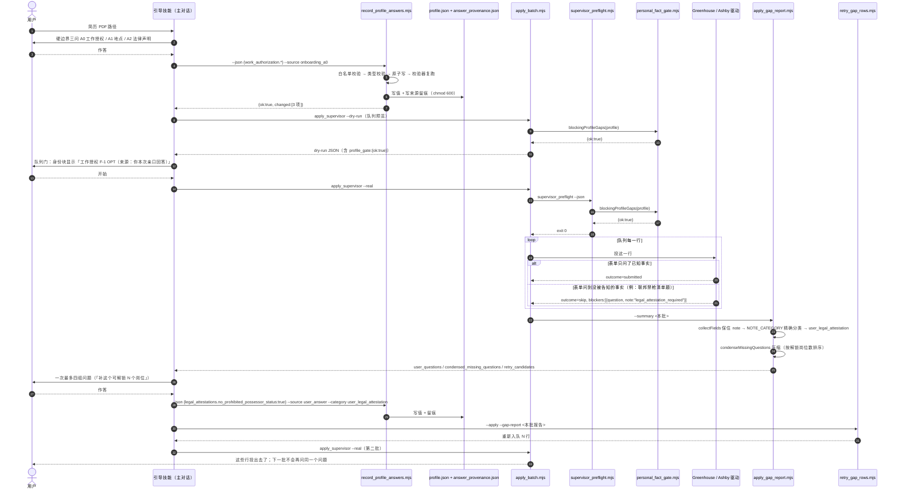
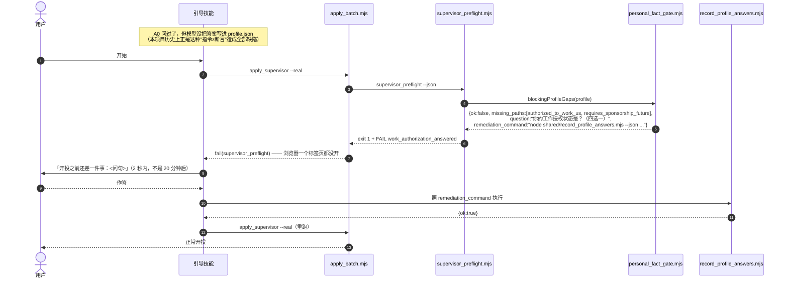
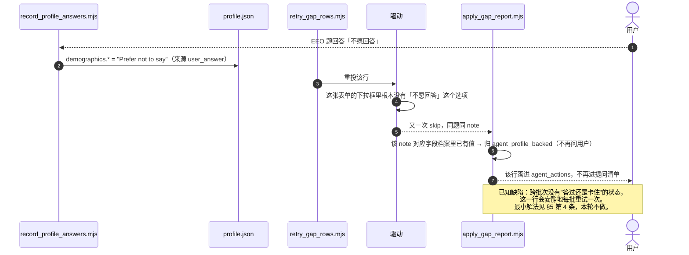
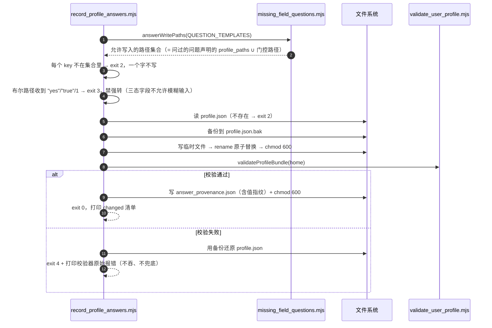

# DESIGN — 被阻塞的问题怎么变成一句问用户的话 + 出厂模板预填的处置

> 边界声明：本轮**只出设计**。除本文件外没有改动任何文件，没有跑投递，没有读写 `~/.mrweirdo-jobs/`。

---

## 0. 给拍板人（人话版，不需要懂编程）

### 0.1 现在这个死结是什么

把产品想成一家帮你代填表格的代办公司。表格上有一栏「你有没有美国工作授权？」

- **上个月以前**：代办员遇到这一栏，不管你说过没说过，一律替你打勾「有」。这是**说谎**。
- **上两轮修完之后**：代办员学会了「你没告诉过我，我就不填」。这是对的。**但是**——他把这张没填完的表格塞回抽屉，**不告诉你他卡在哪一栏**。你只看到「今天投了 0 家」，不知道为什么。
- **更麻烦的是**：新用户拿到的空白档案里，这一栏被工厂**预先打好了「有」**。所以对大多数新用户来说，代办员根本没机会卡住——他照着那个假勾直接填了。

于是产品现在被夹在两个都不能接受的状态之间：

| 只做一件事 | 结果 |
|---|---|
| 只把工厂预填的假勾清掉 | 代办员天天卡住，**每一行都卡**，而且**从不告诉你卡在哪** → 产品从「说谎」变成「一声不吭什么都不干」 |
| 只教代办员开口问 | 工厂预填的假勾还在，他压根不会卡住，**照样说谎** |

**所以这不是两个 bug，是一件事的两半。必须同一批上线。**

还有一处必须一起说清楚的细节：代办员卡住之后，系统内部有一张分类表决定「这一栏该问用户、还是系统自己能填」。今天这张表把工作授权、性别种族、退伍军人身份**全部归到「系统自己能填」**。所以卡住的行不但不会问你，还会被派回给系统「你自己填」——系统填不出来，再卡住，再派回去。**这是一个不出声的死循环**，也是「卡住但不知道卡在哪」的真正机器。

### 0.2 我的方案：一个新用户会经历什么

方案只有一句话：**关于你本人的事实，工厂一律不预填；能填的只有两个来源——你亲口说的，或者从你简历里读到的。凡是没来源的，要么当场问你，要么这一行不投。**

落成三层：

**第一层：出厂即空白。** 所有「关于你本人」的格子（工作授权、人口统计学、法律声明）出厂全是空的。空 = 没人说过。这是最便宜也最可靠的「区分用户亲口说的 vs 工厂默认」的办法——因为工厂什么都没说。

**第二层：一道门，只拦一件事。** 工作授权这一格，是**几乎每张表格都问、不填就整行投不出去**的那一格。所以它单独享受一道「开工前的门」：真正开投之前，系统用代码检查它有没有值；没有就 2 秒内停下来，问你一句（就是引导流程本来就该问的那一句），你答完再开投。
**注意这不是「投递前把所有问题都问一遍」**（那条 2026-06 已经拍板不做，也确实会把上手门槛抬到没人愿意用）。这道门只管一格，判据是「这一格不填，几乎每一行都投不出去」。今天全项目只有这一格够格。

**第三层：其余的，等真实表格问了才问你。** 别的事实（法律声明、居住地、EEO 自愿披露、学历……）继续走现在这条路：真投的时候某张表格问到了 → 那一行停下、一个字都不填 → 批次结束后系统把这一批真实表格问到的问题**压缩合并**成最少的几个问题一次问你 → 你答完自动存进档案 → 自动重投那些行。这条路本来就在（`missing_field_questions.mjs` 那套压缩逻辑真的在跑），本轮只是把「工作授权 / 法律声明 / EEO」这几类**接进这条路**——今天它们被那张分类表挡在门外。

**再加一个收口动作：你答完的东西，用代码写回档案，不再靠 AI 自觉。** 今天的说明书写着「用户答完后更新档案」——那是一句写给 AI 的话，不是代码。本轮新增一个专门的记录命令：只允许写它问过的那几个格子，写完立刻校验，同时记一笔「这个值是谁在什么时候说的」。这样下次就不用再问你（自动复用），出了事也查得到来源。

**新用户的完整体感（改完之后）：**

1. 装好，发一份简历给它。
2. 它问 3 个硬边界问题（工作授权 / 地点 / 法律声明）——**和今天一样，一个都没多问**。
3. 给你看要投的队列，你说「开始」。
4. **如果第 2 步的答案没落进档案（AI 走神了），这里 2 秒内停下来补问一句，而不是让你等 20 分钟再看到 0 投递。**
5. 投完给你一份总结：投出去几家、几家因为缺什么停下了。
6. 它一次问你最多 4 组问题（按「补这个能解锁几个岗位」排序），你答完自动重投。
7. 你答过的东西永久生效，第二批不会再问。

### 0.3 分几批上线，每批的风险

| 批次 | 内容 | 上线后会怎样 | 风险 |
|---|---|---|---|
| **A（必须整批一起上）** | 分类表纠偏 + 答案写回代码 + 开工前那道门 + 清掉工厂预填 | 新用户体感如上；现有唯一用户（你）**逐格零变化**（你的档案 4 个格子都填了，那道门直接放行） | 低。中途任何一个提交点掉链子都不会比今天更糟（见 §11 的提交顺序论证） |
| **B（A 之后，可隔天）** | 另外 6 处同类编造：居住地、逃犯/管制药物那一组、是否年满 18、学籍、担保话术、学历 | 这些题从「替你说」改成「问你一次」。会**多问 1-2 组问题** | 中。**必须在 A 之后**——A 没上就把它们改成阻塞，等于再造一遍今天这个死结 |
| **C（收尾，可拖）** | 删死配置、退伍军人选项排序、国家写死、投递答案留痕（F6） | 用户无感 | 低 |

**没有任何一批会让产品短期变得更不可用**——这一条我在 §11 逐个提交点验证过，不是口号。

**两个需要你一句话拍板的（我不替你决定）：**

1. **「你是否年满 18 岁」**这一格今天写死答「是」。严格说这也是替你陈述事实（大一新生真有 17 岁的）。改成「没问过就停下问你」是诚实的做法，代价是问你多一个问题。**改，还是保留写死并记一笔留痕？** 我的建议：改（和逃犯那一组一起，共用一个问题，不额外多问）。
2. **「你是否拥有不受限制的工作授权」**这一格未知时答「否」。这个方向是**对你不利**（少宣称），不是抬高自己。**保留这个保守答案（但加留痕），还是也改成停下问你？** 我的建议：保留 + 留痕，因为改成阻塞会额外卡住一批行，收益却只是把「保守」换成「问一句」。

---

## 1. Implementation Approach

### 1.1 需求难点（三条，逐条对应一个设计选择）

**难点一：三态字段已经修好了，但「阻塞」这个信号是个哑弹。**
上两轮把 `authorized_to_work_us` 等字段从真假判断改成显式三分支，缺值返回阻塞（`answer_routing.mjs:184-241`），驱动侧也接线了（Ashby `:546` 走 `pending_for_main_claude`、Greenhouse `:1512` 走 `needs_user_answer`）。信号发出来了，**但没有接收方**：

- `apply_gap_report.mjs:91` 收集阻塞项时写的是 `push(b.question || b, 'blocker')`。`b` 是 `{question, note, detail}`，取了 `b.question`（字符串）之后，**`note` 被整个丢掉**（`push` 只在收到对象时读 `note`，见 `:86`）。驱动辛辛苦苦标注的 `work_authorization_required` 到这里就没了。
- 就算 note 侥幸留下来，`classifyField` `:137` 那条超长正则会把 `legally authorized|authorized to work|gender|race|veteran|disability` 判成 `agent_profile_backed`（系统按档案自动填），于是这些行落进 `agent_actions`，动作文案是 `Do not ask the user first. Fill from existing profile`（`:368`）——**系统被告知"你自己从档案里填"，而档案里恰恰没有**。下一轮重试再卡住，再被派回来。**这是一个不发声的死循环，也是「卡住但不知道卡在哪」的真正机器。**

所以 F5 不是「改一条正则」，是**修一条从驱动到提问的信号通路**，三段都要通：note 保住 → 按 note 精确分类 → 分类进得了 `user_*` 与 `RETRYABLE_CATEGORIES`。

**难点二：「什么时候问」不能一刀切。**
本项目有两条互相拉扯的既有约束：

- 已实现且带覆盖校验的设计：问题集从**真实岗位表单反推 + 压缩**（`missing_field_questions.mjs:137-181`，`condenseMissingQuestions` 带 coverage invariant 断言）。
- 2026-06 拍板：**不做投递前探测**。

一刀切「全部投递后问」→ 工作授权这一格会让第一批 100% 空跑（用户等 20 分钟看到 0 投递）。一刀切「投递前问完」→ 违反拍板、且把上手门槛从 3 个问题抬到 20 个，直接打击「有人用」这个第一判据。

**取舍论证（选中的方案）**：按「阻塞面」分流，判据可量化——
> **某个事实缺失会阻塞的行占比 ≥ 80% ⇒ 前置一道门；否则一律走投递后压缩提问。**

按这个判据过一遍今天的全部个人事实字段，**只有工作授权两格够格**（几乎每张 Greenhouse / Ashby 表都问；`workAuthGapFor` 的题面正则覆盖 4 类真实问法，BUILD §14 实测 6 档案 × 4 题面全阻塞）。法律声明、居住地、EEO、学历都只阻塞一部分行 → 全部走投递后。**这个判据同时解释了为什么它不违反「不做投递前探测」**：它不探测任何表单，它只是把引导流程 A0 那个**本来就该问的**问题变成代码断言。

**难点三：所有缺陷的共同根因是「代码分不出用户亲口说的和出厂默认」，而最贵的解法未必是最好的。**
理论上最彻底的解法是给每个字段包一层 `{value, source}`。实测代价：全仓库 40+ 处读点要改，其中两个驱动文件已超行数上限、**净增必须为 0**（`.claude/file_size_limits.json`，BUILD §15 方向 1 记录过 hook 是按单次编辑前后比的，"先减后加"都不成立）。做不到，也不该做。

选中的是**两层**：
- **第一层（免费且可靠）：出厂一律 null。** 非 null ⇒ 一定有人说过。这已经是 `legal_attestations` 的既有体例（`profile.template.json:47-52` 自带 `_notes`），上一轮 `demographics` 也照这个体例改完了（`:54-61`）。工作授权只是补上第三块。
- **第二层（增量、只读用途）：`answer_provenance.json` 旁挂文件**，记录每个个人事实的来源（用户亲口 / 引导 A0 / 引导 A2 / 简历推断 / 历史遗留未核实）+ 值指纹 + 时间。**明确不参与填表判断**（填表只看三态值就够了）——理由见 ADR-4。

### 1.2 方案总览：一条信号通路 + 一道门 + 一个写回口

```
出厂空白 ──► 引导 A0/A2 ──► [记录命令] ──► profile.json ──┐
                                       + provenance      │
                                                          ▼
                       ┌────────────────────  [开工前那道门：只查工作授权]
                       │  缺 → 2 秒停下 + 一句问话 + 一条可直接执行的记录命令
                       ▼
                   真实投递 ──► 驱动遇到没被告知的事实 ──► 整行阻塞，一个字不填
                                                          │ blockers:[{question, note}]
                                                          ▼
                                          [缺口报告：按 note 精确分类 → user_*]
                                                          │
                                                          ▼
                                        [压缩成最少的几组问题（既有机制）]
                                                          │
                                                          ▼
                                    用户回答 ──► [记录命令：白名单校验 + 写回 + 留痕]
                                                          │
                                                          ▼
                                             [重投那些行（既有机制）]
```

其中 **既有、不改**：压缩提问（`condenseMissingQuestions`）、重投（`retry_gap_rows.mjs`）、驱动侧阻塞（上两轮已完成）。
**新增**：`personal_fact_gate.mjs`（那道门的纯判定）、`record_profile_answers.mjs`（写回口）、`answer_provenance.mjs`（留痕读写）。
**改造**：`apply_gap_report.mjs`（信号通路三段）、`missing_field_questions.mjs`（问题模板搬家 + 新增类目 + 导出写入白名单）、`supervisor_preflight.mjs` / `apply_batch.mjs`（挂门）、`profile.template.json`（清预填）。

### 1.3 一个必须点名的实现陷阱（不写清楚 builder 一定会踩）

`classifyField` 里现有的 `note` 变量是 `field.note || outcome.reason`（`:110`）——**行级 reason 会冒充字段级 note**。而 `classifyUnsubmitted()`（`greenhouse_apply_driver.mjs:1761-1775`）返回的行级 reason 里，`profile_full_address_required` / `company_relationship_answer_required` / `legal_attestation_required` 这几个字符串**恰好和字段级 note 同名**。

所以新增的 note→类目查表**必须只读 `field.note`，绝不能读那个带 reason 兜底的变量**。否则一行因为法律声明被拦，同一行里的「你的 GPA 是多少」也会被打上「法律声明」标签，问出一句驴唇不对马嘴的话——看起来像修好了，行为是错的。

### 1.4 一个必须遵守的硬约束（上一轮真红过）

`.claude/skills/mrweirdo-onboard/SKILL.md` 现在 **495 行，CI 门禁上限 500**（`scripts/public_alpha_gate.mjs:121`）。本设计要求 SKILL.md 的净增 **≤ 4 行**，所有新增说明文字落到 `references/` 两个文件里（不受门禁）。两个驱动文件净增必须 = 0。

---

## 2. File List

### 批次 A（必须整批一起上线）

| 文件 | 新建/修改 | 行数影响 | 干什么 |
|---|---|---:|---|
| `shared/missing_field_questions.mjs` | 修改 | 181 → ~265 | `QUESTION_TEMPLATES` 从 `apply_gap_report.mjs` 搬进来（成为唯一真相源）+ 新增 3 个类目模板 + 导出 `answerWritePaths()` 写入白名单 |
| `shared/apply_gap_report.mjs` | 修改 | 533 → ~500 | 模板搬走（-67）；`collectFields` 保住 note；新增 note→类目查表；把个人事实从超长正则里摘出来改成「档案有值才算系统能填」；补 `RETRYABLE_CATEGORIES` 与 `onboarding_candidates` 名单 |
| `shared/personal_fact_gate.mjs` | **新建** | ~75 | 纯函数：`blockingProfileGaps(profile)` —— 那道门的判定 + 人话问句 + 可直接执行的记录命令 |
| `shared/answer_provenance.mjs` | **新建** | ~95 | 纯 + IO：来源留痕的读 / 写 / 指纹 / 一次性回填 |
| `shared/record_profile_answers.mjs` | **新建** | ~155 | CLI：白名单校验 → 类型校验 → 原子写 profile.json → 写留痕 → 重跑校验器，任一步失败整体回滚 |
| `shared/supervisor_preflight.mjs` | 修改 | 246 → ~253 | `checks` 数组加一项 `work_authorization_answered`（硬失败 ⇒ 真实批次拒绝开工） |
| `shared/apply_batch.mjs` | 修改 | 427 → ~434 | dry-run 路径也算一次门（只算不拦），把问句放进 dry-run 输出，让队列门在用户说「开始」**之前**就能看见 |
| `shared/profile.template.json` | 修改 | 131 → ~134 | `work_authorization` 三个布尔 → `null`、`visa_status` → `""`，加 `_notes`（与 `legal_attestations` / `demographics` 同体例） |
| `scripts/secure_profile_files.sh` | 修改 | 10 → ~16 | 新增一个「存在才 chmod」的可选清单，收 `answer_provenance.json` |
| `.claude/skills/mrweirdo-onboard/SKILL.md` | 修改 | 495 → **≤ 499** | Step 5 队列门的身份块加「来源」；Step 6 把「更新档案」改成调记录命令。**每处只许一行** |
| `.claude/skills/mrweirdo-onboard/references/run-and-database.md` | 修改 | +~35 | 记录命令用法、门被拦时的处置、重投流程 |
| `.claude/skills/mrweirdo-onboard/references/intake-and-profile.md` | 修改 | +~15 | A0/A2 答案必须经记录命令落盘，不许直接手写 JSON |
| `test/apply_gap_report.test.mjs` | 修改 | +~90 / 改 1 条断言 | 见 §12.4（**改断言需要显式授权，理由已写明**） |
| `test/personal_facts_guard.test.mjs` | 修改 | +~25 | 模板三个工作授权布尔必须为 null（防 I 项回潮） |
| `test/personal_fact_gate.test.mjs` | **新建** | ~90 | 门的三态 + 现有真实用户档案形状必须放行 |
| `test/record_profile_answers.test.mjs` | **新建** | ~140 | 白名单拒写、类型拒写、校验失败回滚、幂等、留痕正确 |
| `test/missing_info_loop.test.mjs` | **新建** | ~120 | **闭环证明**：阻塞结果 → 缺口报告 → 按模板写回 → 重跑报告 → 问题清单变空 |
| `CHANGELOG.md` | 修改 | +~8 | 登记表要求 |

批次 A 合计：新建 5 个源文件 + 3 个测试文件，修改 10 个文件。**没有任何文件触碰行数上限。**

### 批次 B（A 之后）

| 文件 | 行数影响 | 干什么 |
|---|---|---|
| `shared/greenhouse_value_rules.mjs` | 210 → ~265 | 接收从驱动里搬出来的判定：禁枪清单题（D）、居住地三态（B）、学籍三态（F）、年满 18（C，待拍板） |
| `shared/greenhouse_apply_driver.mjs` | 1914 → **≤ 1914** | 只留委托调用。D 项 10 条分支合并成 1 条 ⇒ 净减，正好给 B/F/C 腾额度 |
| `shared/answer_templates.mjs` | 55 → ~59 | G 项：担保话术三态，没问过就不写那半句（**不阻塞**，理由见 §10-G） |
| `shared/missing_field_questions.mjs` | ~265 → ~285 | 新增 `user_education_credentials` 类目 |
| `test/greenhouse_value_rules.test.mjs` / 新建 `test/prohibited_possessor.test.mjs` | +~150 | 每条新判定的三态全分支 |

### 批次 C（收尾）

`shared/answer_bank.json`（删死键）、两个驱动的内置兜底 bank、`greenhouse_apply_driver.mjs:1640-1641`（退伍军人候选序）、`:1594`（国家）、`:1632`（全职意向）、`test/json_shapes.test.mjs`、F6 投递答案留痕（另出设计）、`missing_field_questions.mjs` 第 18 / 32 行两条中文问句里的被弃用旧叫法顺手改掉。

---

## 3. 数据结构与接口


> 说明：本项目全部是 ESM 纯函数模块，没有 class、没有构造器。上图的 `<<module>>` 框把模块当类画，方法签名 = 导出的函数签名，**类型注解就是 builder 要写进 JSDoc 的那份**。

### 3.1 三个新模块的精确契约

```js
// shared/personal_fact_gate.mjs —— 纯函数，零 IO，可单测
export const GATED_PATHS = [
  'work_authorization.authorized_to_work_us',
  'work_authorization.requires_sponsorship_future',
];

/**
 * @param {object} profile  ~/.mrweirdo-jobs/profile.json 已解析对象
 * @returns {{ok: boolean, missing_paths: string[], category: string,
 *            question: string, remediation_command: string}}
 * ok=false 当且仅当 GATED_PATHS 里任一格既不是 true 也不是 false。
 * 只认 boolean：字符串 "true" / "Yes" 一律视为未回答（Fail Fast，禁强转）。
 */
export function blockingProfileGaps(profile = {}) { /* ... */ }
```

```js
// shared/answer_provenance.mjs
export function fingerprint(value)                  // sha256(JSON.stringify(value)).slice(0,16)
export function readProvenance(home)                // 缺文件 → {version:1, entries:{}}
export function recordEntries(home, changes, meta)  // meta: {source, asked_by, category}
export function sourceFor(home, path, currentValue) // 指纹对不上 → 'unknown'（陈旧留痕不撒谎）
export function backfillLegacy(home, profile)       // 一次性：有值但无留痕 → legacy_unverified
```

```js
// shared/record_profile_answers.mjs  CLI
// node shared/record_profile_answers.mjs \
//   --json '{"work_authorization.authorized_to_work_us": true,
//            "work_authorization.requires_sponsorship_future": true,
//            "work_authorization.visa_status": "F-1 OPT"}' \
//   --source user_answer --category user_work_authorization --asked-by queue_gate [--dry-run]
//
// 退出码：0 成功 / 2 参数或白名单违规 / 3 类型违规 / 4 写后校验失败（已回滚）
// stdout：{ok, changed:[{path,from,to}], skipped:[], provenance_written:N, validation:{ok,issues}}
```

### 3.2 缺口报告新增的两张表（数据，不是代码逻辑）

**note → 类目（只查 `field.note`，绝不查带 reason 兜底的变量，理由见 §1.3）**

| 驱动发出的 note | 归到哪一类 | 今天归到哪（错在哪） |
|---|---|---|
| `work_authorization_required` | `user_work_authorization` | note 被丢 → 题面命中超长正则 → `agent_profile_backed`（系统自填，填不出来） |
| `sponsorship_future_required` | `user_work_authorization` | 同上 |
| `legal_attestation_required` | `user_legal_attestation` | `unknown_user_fact`（问得出来，但问句是万能句，用户看不懂在问什么） |
| `current_residence_required` | `user_full_address` | 落 `unknown_user_fact` |
| `profile_full_address_required` | `user_full_address` | 已正确（保持） |
| `specific_city_fact_unconfirmed` | `user_logistics_fact` | 已正确（保持） |
| `external_form_completion_required` | `user_external_form_completion` | 走题面正则，间接正确 |
| `export_control_answer_required` | `user_legal_attestation` | `unknown_user_fact` |
| `contractual_obligations_answer_required` | `user_compliance_relationship_or_restriction` | 走题面正则 |
| `company_relationship_answer_required` | `user_compliance_relationship_or_restriction` | 走题面正则 |
| `government_related_relative_answer_required` | `user_government_relative_compliance` | 走题面正则 |
| `english_fluency_answer_required` / `language_proficiency_not_in_profile` | `user_language_or_skill_level` | 走题面正则 |
| `availability_commitment_answer_required` / `part_time_availability_answer_required` | `user_earliest_start_date` | 走题面正则 |
| `location_not_in_profile_preferences` | `user_work_location_commitment` | 走题面正则 |
| 表里没有的 note | **不处理**，继续走原有题面正则 | —— |

**新增 3 个问题类目（模板）**

| 类目 | priority | profile_paths | 问句要点 | value_type |
|---|---:|---|---|---|
| `user_work_authorization` | 1 | `work_authorization.visa_status` / `.authorized_to_work_us` / `.requires_sponsorship_now` / `.requires_sponsorship_future` | 复用引导 A0 的四选项（美国公民或绿卡 / F-1 已有 CPT 或 OPT / F-1 现在和将来都要担保 / 其他），**措辞与 A0 逐字一致**，用户不会觉得被问了两遍不同的话 | enum→boolean 三元组 |
| `user_legal_attestation` | 6 | `legal_attestations.no_prohibited_possessor_status`（批次 B 加 `.at_least_18`） | 一句话说明这是联邦表格的固定一组题，一次确认覆盖全组；不确认就跳过这些行 | boolean |
| `user_demographics_eeo` | 15 | `demographics.race` / `.hispanic_or_latino` / `.gender` / `.veteran_status` / `.disability_status` | **必须写明自愿**：默认「不愿回答」，只有你主动说才填；这张表格没有「不愿回答」选项时你可以让我跳过这个岗位 | string |

**为什么 EEO 的 priority 给到 15**：它排在所有实质性缺口之后，Step 6「最多问四组」的额度先给能解锁岗位的问题。它只在**表单没有「不愿回答」选项、驱动真的填不进去**时才会冒出来——那时候它确实是一个用户决策（自己选一个 / 跳过这个岗位），系统无权代答。

**为什么不需要动 `QUESTION_GROUPS`**：`validateQuestionGroups()` 只校验已声明的分组；新类目走 `condenseMissingQuestions` 的 singleton 分支（`missing_field_questions.mjs:160-172`）自动成为独立问题。工作授权本来就该独立问（一个问题四个选项），EEO 更不该和别的题捆在一起。**零改动拿到正确行为。**

---

## 4. 调用流

### 4.1 正常路：新用户从装好到投出去



### 4.2 失败路 1（本设计的核心保护）：工作授权没落进档案



**对照没有这道门时会发生什么**（也就是「只清模板不修 F5」的世界）：20 行全部真的打开浏览器 → 每行加载页面、填一半、卡在工作授权 → 全部 skip → 用户等了 20 分钟看到「投出 0 家」→ 缺口报告把这些行判给「系统自己填」→ 系统填不出来 → 重投 → 再卡。**这就是 lead 说的「比现在更糟的中间态」，这道门是它唯一的解药。**

### 4.3 失败路 2：用户答完，同一行又被同一题卡住



### 4.4 写回口内部（Fail Fast，档案要么整体更新、要么原样不动）



---

## 5. Anything UNCLEAR

1. **本项目缺 `.claude/arnold/roles/architect.md`（architect 岗位补充说明）。** 已确认该文件不存在（同目录只有 `_README.md` / `builder.md` / `lead.md`）。本设计的「项目铁律」是从 `PROJECT_MEMORY.md` 四条长期原则、`builder.md` 家规、登记表 `ci_smoke.main_chain` 反推的（§9）。**若另有未成文的架构家规，请补进那个文件，我会按它复核本设计。**

2. **「你是否年满 18 岁」要不要改成阻塞？需要拍板人一句话。**（§10-C 两个选项都写了代价）我的建议是改，并且和禁枪清单那一组共用同一个问题，所以用户感知是「多了半句话」而不是「多了一个问题」。**不拍板我不会让 builder 动它**——擅自改会多阻塞一批行，属于「让产品短期更不可用」，本轮明令禁止。

3. **「不受限制的工作授权」未知时的保守答 `No` 要不要保留？**（§10-H）建议保留但加溯源 note（`work_auth_without_restriction_assumed_no`），让 F6 的留痕能看见它是推的不是答的。**改成阻塞会额外卡住一批行，收益只是把「保守」换成「问一句」——我判断不划算，但这是产品取舍，请拍板人确认。**

4. **跨批次「答过仍被卡」没有状态，本设计未解**（§4.3）。最小解法：在 `feedback` 表新增一列 `blocked_note`，同一 `(job_id, note)` 连续两批出现即把该行标 `permanently_blocked`、不再重投也不再提问。**代价是一次数据表结构变更（不可逆）**，且登记表 `ci_smoke.schema_upgrade_path` 那格是空的（没有登记「改表要同步改哪几处」）。所以我把它拆出去，建议随 F6 审计留痕一起单独设计，不塞进本轮。

5. **EEO 题在表单不提供「不愿回答」选项时，用户说「跳过这个岗位」要不要落成永久偏好？**（新增一个 `demographics.decline_and_skip_rows` 字段）**本轮不加**——按字段克制原则，先看真实发生频次再说；现在加等于凭空猜一个用户行为。真实批次跑过之后如果这条反复出现，再补。

6. **本设计假设「引导流程 A0 的答案原本就应该落进 `work_authorization`」**——这一条我核实过是既有约定（`references/intake-and-profile.md:52-57` 明确要求 A0 写成那四个规范键；`validate_user_profile.mjs:59-73` 也要求这四个键必须存在）。**所以那道门不是新增门槛，是把既有约定从"给模型的指令"升级成"代码断言"。** 如果拍板人认为 A0 本来就允许留空，那这道门的定位要重谈——但那样的话产品就只剩「每一行都卡」这一条路了。

7. **门的判据阈值（阻塞面 ≥ 80% ⇒ 前置）是我定的。** 今天只有工作授权两格越线，判断依据是 BUILD §14 的 6 档案 × 4 题面实测和 `workAuthGapFor` 的题面覆盖。**这个阈值没有真实批次数据背书**（41 天零投递）。第一批真投跑完后应该用真实数据复核：如果法律声明那一组的阻塞面也逼近 80%，它就该升级进门。

---

## 6. 8 项质量属性取舍表

| 质量属性 | 指标（本设计的承诺） | 显式牺牲了什么 |
|---|---|---|
| **Performance 性能** | 门的判定：纯对象取值 + 4 次 `===` 比较，**< 1 ms**（无 IO，profile 已被 preflight 读进内存）。缺口报告新增 note 查表是 O(1) 哈希，每字段新增 2 条正则，**30 行批次的报告生成新增 < 10 ms**（现值量级为百毫秒）。写回命令：读 + 写 2 个小 JSON + 一次校验器子进程，**< 300 ms**。**上述为设计预算，builder 交活时须贴实测值**（本轮禁跑真实投递，无法在设计阶段测端到端） | 门在 `--real` 路径上多跑一次 profile 读取（preflight 自己已经读过，实际零新增 IO）。为了做到「要么整体更新要么原样不动」，写回命令用了备份 + 重命名 + 复跑校验器，比直接写慢约 200 ms——**用延迟换档案永不残缺** |
| **Scalability 扩展性** | 新增一个「关于本人的事实」类问题的成本：**1 条 note 映射 + 1 个问题模板 = 2 处改动，0 处驱动改动**。今天同样的事要改 4 处（驱动分支 / 分类正则 / 模板 / 重试白名单） | 牺牲了「一条正则搞定一切」的紧凑：`classifyField` 会多出 3 个条件分支，文件从 533 长到约 500（因为模板搬走反而净减）。多了 3 个新文件要维护 |
| **Security 安全** | 写回命令**只能写白名单路径**（白名单 = 问过的问题自己声明的 `profile_paths`，模板即权限，不存在"能问不能写"或"能写没问过"的缝）。新文件 `answer_provenance.json` **chmod 600**。留痕只存路径 + 指纹 + 时间，**不存值本身**（不因为审计需求增加一份明文个人数据副本） | 白名单让「临时手改一个没在问题模板里的字段」这条路走不通——只能改模板或手编 JSON。这是有意的：本轮全部缺陷都源自"随手写档案，没人知道值从哪来" |
| **Maintainability 可维护性** | 问题模板成为**唯一真相源**：一处定义同时决定「问什么 / 允许写哪些格 / 压缩怎么分组 / 重试放不放行」。所有个人事实判定进纯函数模块，两个超限驱动**净增 0 行**（批次 B 的 D 项合并后净减，给 B/F/C 腾额度） | 模板从 `apply_gap_report.mjs` 搬进 `missing_field_questions.mjs` 会让 `git blame` 断一次；`missing_field_questions.mjs` 从 181 涨到约 265 行（上限 800，安全） |
| **Reliability 可靠性** | 写回失败一律整体还原：档案要么是更新后的完整状态、要么与改动前逐字节相同（exit 4 + 打印校验器原始报错）。门只认 boolean，字符串 `"true"` 一律当没回答（**禁强转，Fail Fast**）。留痕带值指纹，指纹对不上就报 `unknown` 而不是撒谎。闭环有测试兜底（`missing_info_loop.test.mjs`：阻塞 → 提问 → 写回 → 问题清单变空） | 门是硬失败：档案缺工作授权时**整批拒绝开工**。极端情况——用户确实不知道自己的授权状态——他会被卡在门口。缓解：问句提供「其他 / 不确定」选项，选它写 `false` 到 `authorized_to_work_us` 并在 `visa_status` 记原话，行为是保守跳过而不是死锁 |
| **Interoperability 互操作** | 驱动 → 报告 → 提问 → 写回 全链路只用两个既有信号名（`needs_user_answer` / `pending_for_main_claude`）和一个既有 note 字段，**不发明新协议**。两个 ATS 平台的差异（Ashby 用 pending、Greenhouse 用 unanswerable，BUILD §12 已论证是有意为之）在报告层被统一吸收 | 沿用 note 字符串当契约 = 弱类型契约，驱动侧改一个 note 拼写不会有编译错误。缓解：新增测试断言「NOTE_CATEGORY 里每个键都能在 `shared/*.mjs` 里 grep 到」，改名即红 |
| **Compliance 合规** | 兑现红线「不编造个人事实」的**可执行断言**：出厂全空 + 三态阻塞 + 分类归 `user_*`。EEO 自愿披露**默认拒答**，只有用户主动说才填，问句里必须写明自愿。全部数据留在本机（与免责声明一致），留痕不外传 | EEO 在表单不提供拒答选项时会去问用户——**比今天多打扰一次**。这是有意的：另一条路是永久静默跳过该岗位且不告诉用户，那正是本轮要消灭的行为 |
| **Cost 成本** | 零新增服务、零依赖、零外部调用。用户侧问题总量：引导 3 问（**不变**）+ 门 0-1 问（只在 A0 没落盘时）+ 每批最多 4 组（**不变，既有上限**）。工程量：批次 A 约 900 行（含约 350 行测试），批次 B 约 250 行，批次 C 约 150 行 | 新增 5 个源文件 = 5 份长期维护负担。批次 B 会让「多问 1-2 组问题」成为常态，换来的是不再替用户做法律陈述——**这个换法我认为必须做，但它确实是把摩擦从系统转移给了用户** |

---

## 7. ADR（架构决策记录）

### ADR-1：按「阻塞面」分流提问时机，只有工作授权走前置门

- **Status**：Proposed（待拍板人确认）
- **Date**：2026-07-25
- **Context**：两条既有约束打架——「问题集从真实表单反推 + 压缩」（已实现、带覆盖校验）vs「工作授权缺失会让 100% 的行投不出去」。用户口述希望「投递前问完」，但他自己 2026-06 拍板过「不做投递前探测」。
- **Decision**：定量判据——**某事实缺失导致阻塞的行占比 ≥ 80% ⇒ 前置一道门；否则一律走投递后压缩提问。** 今天只有 `authorized_to_work_us` 与 `requires_sponsorship_future` 越线。这道门不探测任何表单，只是把引导 A0 的既有问题变成代码断言。
- **Consequences**：+ 第一批不会空跑；+ 上手门槛不变（仍是 3 个硬边界问题）；+ 判据可量化、以后新字段照着量就行。− 多了一个「批次可能在开工前被拒」的失败模式，说明书要教会主对话怎么处置。− 阈值没有真实批次数据背书，第一批真投后须复核。
- **Alternatives**：① 全部投递后问 → 第一批 100% 空跑，用户等 20 分钟看到 0 投递（**这正是 lead 点名禁止的中间态**）。② 全部投递前问 → 违反 2026-06 拍板，上手门槛从 3 问抬到 20 问，直接打击「有人用」。③ 缺工作授权时只跳过受影响的行、不拦整批 → 因为受影响的是全部行，等价于方案 ①。

### ADR-2：出厂模板一律 null，把「谁说的」做成结构性事实

- **Status**：Proposed
- **Date**：2026-07-25
- **Context**：本轮全部缺陷的共同根因是「代码分不出用户亲口说的和出厂默认」。RISK_REPORT 的决定性证据：真实档案的 5 个人口统计学值与模板出厂值**逐字节完全一致**，而引导流程从没问过这些题。
- **Decision**：所有「关于用户本人」的字段出厂一律 `null` / `""`，并在同一个 JSON 块里用 `_notes` 写清楚为什么空着（沿用 `legal_attestations` 与 `demographics` 的既有体例）。**非 null ⇒ 一定有人说过**，这个不变量由测试守卫。
- **Consequences**：+ 免费拿到 90% 的来源可区分性，零运行期开销；+ 与 `intake-and-profile.md:70-71` 那句 `nullable unless explicit` 终于对齐（今天模板自己违反自己的规范）；+ `validate_user_profile.mjs:71` 用的是 `typeOfNullable`，null 合法，**校验器不用改**。− 模板从「能直接跑的示例」退化成「形状说明」，照抄模板的人会得到一份必须补齐的档案（这正是想要的）。
- **Alternatives**：① 每个字段包 `{value, source}` → 全仓 40+ 读点要改，两个超限驱动净增必须为 0，**物理上做不到**。② 留预填但另存一份「出厂值快照」做对比 → 用户碰巧同意默认值时无法区分，等于没解决。③ 只清工作授权、留住其它 → 下一个平台照样复发（RISK_REPORT 教训第 2 条）。

### ADR-3：缺口分类改由「驱动发出的 note」主导，题面正则退为兜底

- **Status**：Proposed
- **Date**：2026-07-25
- **Context**：`classifyField` 今天靠一条约 40 个分支的题面正则（`:137`）判断归属，而题面来自各家表单、写法千奇百怪。同一件事驱动内部其实已经有精确标识（note），却在 `collectFields` 里被丢掉了。
- **Decision**：`collectFields` 保住 note（把整个 blocker 对象传下去）；`classifyField` 先查 note→类目表（**只查字段自己的 note**），查不到再走原有题面正则。个人事实从超长正则里摘出来，改成「档案里有明确值才算系统能填」——照抄同文件 GPA `:171` 与语言 `:166-170` 的既有正确写法。
- **Consequences**：+ 分类准确度不再依赖题面措辞；+ 新增一类问题的成本从 4 处改动降到 2 处；+ 与红线原文（`PRD-v3.md:230` 指定 `user_*` 分类为执行机制）终于一致。− note 是弱类型契约，拼写改了不会编译报错（用 grep 断言测试兜住）。− 必须只读字段级 note，读了那个带行级 reason 兜底的变量就会张冠李戴（§1.3）。
- **Alternatives**：① 继续加长那条正则 → 越长越脆，且解决不了「档案有值时不该再问」这一半。② 让驱动直接输出类目名 → 把产品分类知识塞进两个超限驱动文件，净增必须为 0，且分类逻辑会分裂成两份。

### ADR-4：来源留痕只用于报告与审计，不参与填表判断

- **Status**：Proposed
- **Date**：2026-07-25
- **Context**：有了 `answer_provenance.json` 之后，很自然会想「只有 source=user_answer 的值才允许填表」。
- **Decision**：**不这么做。** 填表判断只看三态值（已实现、已被 146 条测试覆盖）。留痕只用于：队列门显示来源、F6 审计、以及将来判断哪些事实值得复核。现有真实用户的档案没有留痕，一次性回填为 `legacy_unverified`，**不因此改变任何填表行为**。
- **Consequences**：+ 状态空间不翻倍（三态 × 五种来源 = 15 种组合的噩梦）；+ 现有唯一用户逐格零变化；+ 留痕文件损坏 / 丢失不影响投递，是纯增益组件。− 「用户亲口说的」和「模型从简历推断的」在填表时同等对待。缓解：`intake-and-profile.md:145-147` 本来就禁止把签证 / GPA / 人口统计学 / 法律声明 / 背景调查 / 搬迁标成推断值，本设计在写回口再加一道白名单，等于把那条禁令也落成了代码。
- **Alternatives**：① 留痕参与判断 → 现有用户所有字段变成 `legacy_unverified`，第一批全部阻塞，**当场制造"比现在更糟"的中间态**。② 不做留痕 → 队列门无法回答「这个值是谁说的」，F6 也没有地基。

### ADR-5：答案写回必须走代码，白名单等于问题模板

- **Status**：Proposed
- **Date**：2026-07-25
- **Context**：今天 `SKILL.md:428` 写的是「用户答完后更新档案」——一句给模型的自然语言指令。`PROJECT_MEMORY.md` 第 1 条长期原则的实证正是：**写在文档里的红线等于没有。**
- **Decision**：新增 `record_profile_answers.mjs`，可写路径集合**由问题模板的 `profile_paths` 生成**（模板即权限）。类型不匹配 Fail Fast（三态字段只收 `true` / `false`，`"yes"` 一律拒绝）。写后立刻复跑校验器，失败整体回滚。
- **Consequences**：+ 「问了什么」和「能写什么」在结构上不可能脱节；+ 答案落在驱动读的同一个 `profile.json`，**下次复用是自动的、不需要额外机制**；+ 主对话不再有机会手写 JSON 写错字段名（`standard_answers` 那类错配的成因）。− 想临时改一个没在模板里的字段就得先加模板（有意为之）。− 多一个 CLI 要维护、要写用法说明。
- **Alternatives**：① 继续让模型直接写 JSON → 就是今天这个 bug 的成因，直接违反项目记忆第 1 条。② 让缺口报告自己写回 → 报告是只读分析工具，让它有写档案的权限会把两个职责焊死。

### ADR-6：EEO 自愿披露在表单不提供拒答选项时，问用户而不是静默跳过

- **Status**：Proposed
- **Date**：2026-07-25
- **Context**：驱动对 EEO 五题一律拒答（上一轮已统一）。但如果某张表单的下拉框里根本没有「不愿回答」这个选项，这一行就会永久卡住。今天这类字段被判成 `agent_profile_backed`，系统被告知「你自己从档案里填」，而档案是空的。
- **Decision**：档案里该项为 null 时归 `user_demographics_eeo`（priority 15，排在所有实质缺口之后）；问句必须写明自愿、必须提供「跳过这些岗位」这个出口；用户的拒答被**当作一个正式答案记下来**（`demographics.* = "Prefer not to say"`，来源 `user_answer`），此后永不再问。
- **Consequences**：+ 用户的拒答第一次成为「他自己的选择」而不是工厂预填；+ 不再有静默永久卡住的行。− 会新增一次打扰（只在表单真的没有拒答选项时）。− **需要修改一条现有测试断言**（`test/apply_gap_report.test.mjs:135`），见 §12.4。
- **Alternatives**：① 新建一个 `system_eeo_declined` 类目、永不问用户 → 表单没有拒答选项时该行永久静默卡死，且技术上绕开了红线点名的 `user_*` 机制。② 维持现状归 `agent_profile_backed` → 就是今天的死循环。

---

## 8. 跨栈一致性字段对照表

本项目没有数据库表承载个人事实（`jobs.db` 只存岗位与投递结果），所以「跨栈」这条链是：**档案 JSON → 纯判定模块 → 驱动填表/阻塞 → 结果 JSONL → 缺口报告 → 问题模板 → 写回口 → 回到档案 JSON**。全链只允许一套字段名。

| 档案 JSON 路径 | 类型 | 纯判定模块 | 驱动侧信号 | 结果 JSONL 里的 note | 缺口报告类目 | 问题模板 `profile_paths` | 写回口白名单 |
|---|---|---|---|---|---|---|---|
| `work_authorization.authorized_to_work_us` | `boolean\|null` | `deriveWorkAuthAnswers` → `authorizedAns` / `authorizedNeedsUser`；门 `blockingProfileGaps` | GH `:1512` `needs_user_answer`；Ashby `:546` `pending_for_main_claude` | `work_authorization_required` | `user_work_authorization` | 同左路径 | 允许（boolean 强类型） |
| `work_authorization.requires_sponsorship_future` | `boolean\|null` | 同上 → `sponsorAns` / `sponsorNeedsUser`；门 | 同上 | `sponsorship_future_required` | `user_work_authorization` | 同左路径 | 允许（boolean） |
| `work_authorization.requires_sponsorship_now` | `boolean\|null` | `workAuthWithoutRestrictionAnswer`（批次 C 复核） | — | — | `user_work_authorization`（同组作答） | 同左路径 | 允许（boolean） |
| `work_authorization.visa_status` | `string` | `authSummary`（`answer_templates.mjs:9-19`）、非移民签证分支 | — | — | `user_work_authorization`（同组作答） | 同左路径 | 允许（string） |
| `legal_attestations.no_prohibited_possessor_status` | `boolean\|null` | 批次 B：`prohibitedPossessorAnswer()` | GH `:731` `needs_user_answer` | `legal_attestation_required` | `user_legal_attestation` | 同左路径 | 允许（boolean） |
| `legal_attestations.at_least_18` | `boolean\|null` | 批次 B（待拍板） | 批次 B | `legal_attestation_required` | `user_legal_attestation` | 同左路径 | 批次 B 起允许 |
| `legal_attestations.conflicting_obligations` | `boolean\|null` | 既有 | GH `:626` | `contractual_obligations_answer_required` | `user_compliance_relationship_or_restriction` | 既有 | 既有 |
| `legal_attestations.relatives_in_federal_government_or_contractors` | `boolean\|null` | 既有 | GH `:656` | `government_related_relative_answer_required` | `user_government_relative_compliance` | 既有 | 既有 |
| `demographics.race` / `.hispanic_or_latino` / `.gender` / `.veteran_status` / `.disability_status` | `string\|null` | 驱动候选表（拒答优先） | 填不进去时留在 `missing` | —（无 note，走题面正则 + 档案有无值） | `user_demographics_eeo` | 同左五路径 | 允许（string） |
| `personal.address_city` / `.address_state` / `.address_country` | `string` | `currentResidenceYesNoAnswer` | GH `:1465` / `answer_routing.mjs:145` | `profile_full_address_required` / `current_residence_required` | `user_full_address` | 既有五路径 | 既有 |
| `education.degree` | `string` | `isGraduateDegree`（含词边界） | 批次 B 起三态 | `education_credentials_required`（批次 B 新增） | `user_education_credentials`（批次 B） | 批次 B | 批次 B |
| `education.currently_enrolled` | `boolean\|null` | 批次 B：`enrollmentAnswer()` | 批次 B | `education_credentials_required` | `user_education_credentials` | 批次 B | 批次 B |
| `education.gpa` | `string` | 既有 | 既有 | — | `user_gpa` | 既有 | 既有 |

**命名风格转换**：全链路统一用下划线小写（`authorized_to_work_us`），**不做任何驼峰转换**。唯一的风格差异发生在纯函数模块内部的局部变量名（`authorizedAns` / `sponsorNeedsUser`），它们**不跨模块传递、不落盘、不进 JSON**，只是函数内部命名。留痕文件的 key 直接用点分档案路径（`work_authorization.authorized_to_work_us`），与问题模板的 `profile_paths` 逐字一致——**这一条由测试守卫**（留痕 key 必须能在模板白名单里找到）。

---

## 9. 本项目铁律对照

> `.claude/arnold/roles/architect.md`（architect 岗位补充说明）**不存在**（同目录只有 `_README.md` / `builder.md` / `lead.md`）。以下逐条对照 `PROJECT_MEMORY.md` 四条长期原则、`builder.md` 的三条家规、以及登记表 `ci_smoke` 已填格。

| 铁律 | 本设计怎么兑现 |
|---|---|
| **红线必须落成代码断言，写在文档里的红线等于没有** | 三处落断言：① 那道门是 `supervisor_preflight` 的 `checks` 项、硬失败拦批次（不是提示）；② 写回口的白名单由问题模板生成、越界 exit 2；③ 出厂全空由 `personal_facts_guard.test.mjs` 守卫。**并且明确废掉了两句"给模型的指令"**：`SKILL.md:428` 的「更新档案」改成调命令，`intake-and-profile.md` 的 A0 落盘改成调命令 |
| **三态字段绝不允许用真假判断读** | 门只认 `=== true` / `=== false`，其余（含字符串 `"true"`）一律算没回答；写回口对布尔路径**拒绝任何非布尔输入**，不做强转；批次 B 的四处（B/D/F/G）全部改成显式三分支 |
| **单用户期的测试必须喂「不像我」的档案** | 新增测试一律喂三类档案：现有真实用户（F-1 OPT）、与他相反的（美国公民 / 明确未获授权）、以及**全空**。`missing_info_loop.test.mjs` 的主用例用的就是全空档案 |
| **投递时"填了什么"必须留痕** | 本轮建地基（`answer_provenance.json` 记来源），F6 的字段级投递留痕排批次 C 单独设计。**没有假装本轮解决了 F6** |
| **测试必须串行跑**（`builder.md`） | 新增测试全部用临时目录 + `onboardTestEnv(home)` 的既有夹具体例，不共享真实家目录；沿用 `npm test` 自带的 `--test-concurrency=1` |
| **交活前 CI 四步全跑**（`builder.md`） | 写进 §12.6 验收标准，且点名 `public_alpha_gate` 的 500 行门禁（上一轮真红过一次） |
| **主流程冒烟优先**（登记表 `ci_smoke.main_chain`） | 主流程是「简历上传 → 分析定岗 → 找岗 → 大批量一键投递 → 报告 → 跟进」。本设计只在「一键投递」前加一道**只在缺值时才触发**的门，现有真实用户档案完整 ⇒ `npm run demo:check` 行为不变。验收要求实测 exit=0 |
| 登记表 `ci_smoke.schema_upgrade_path` / `isolation_field` 两格为空 | 本设计**无数据表结构变更**（§5 第 4 条那个需要改表的想法被明确拆出本轮）；单用户本机产品，无多租户隔离字段 |

---

## 10. §16 十一处逐条处置（含出厂模板）

> 排序 = 建议动手顺序。行号沿用 BUILD §16 的改后行号。

| # | 位置 | 性质 | 处置 | 落哪批 | 改完之后新用户的实际体验 |
|---|---|---|---|---|---|
| **I** | `profile.template.json:41-43` | **出厂预填身份事实**——本轮的要害 | **改**。`authorized_to_work_us` / `requires_sponsorship_now` / `requires_sponsorship_future` → `null`；`visa_status` → `""`；加 `_notes` 说明为什么空着（与 `legal_attestations:48` / `demographics:55` 同体例）。**校验器不用改**（`validate_user_profile.mjs:71` 的 `typeOfNullable` 本来就允许 null） | **A（最后一个提交）** | 引导 A0 答完 → 门放行 → 正常投。A0 没落盘 → 开工前 2 秒被问一句 → 答完正常投。**任何路径都不会出现"全都卡住且不说为什么"** |
| **D** | `:719` `:720` `:725-726` + 同组另外 5 处（`mental defective` / `dishonorable` / `renounced citizenship` / `nonimmigrant visa` / `alien unlawfully`） | **编造法律事实**，且**同一份联邦表格的同一组题被拆成两套标准**：紧邻的重罪题（`:728-731`）没问过就阻塞，这 8 条却直接答 `No` | **改**。这 10 条其实是同一份联邦禁枪清单（fugitive / illegal alien / controlled substance / mental / dishonorable / renounced / restraining order / indictment / domestic violence / felony），档案里对应的就是**一个** `legal_attestations.no_prohibited_possessor_status`。合并成一条与 `:728-731` 逐字同款的三态分支：`=== true → 'No'`（带 `profile_no_prohibited_possessor_status` 溯源）；`=== false` 或 `null` → 阻塞（`legal_attestation_required`）。**注意 `false` 也必须阻塞**——用户说「我有某项问题」时，具体是哪一项无法推导。**10 条分支合并成 1 条，净减约 6 行**，正好给 B/F/C 腾出驱动的行数额度 | **B** | 引导 A2 明确确认过 → 这 10 题全部自动答 `No`（和今天一样，但有据可查）。没确认过 → 这些行停下，批次结束后**一个问题**覆盖整组（不是 10 个问题）。**注意：引导 A2 今天就在问这件事**（`intake-and-profile.md:14`），所以走完引导的用户体感不变 |
| **B** | `:1614` / `:1694` 的 `\|\| 'No'` + `:428` 的 `no_specific_current_location` | **编造居住地事实**（对没填城市的用户直接答「我不住那儿」），而且 `\|\| 'No'` 会把将来任何阻塞返回值悄悄吃掉 | **改**。去掉 `\|\| 'No'`；`:428` 在题面没提到任何已知城市时返回 `{needs_user_answer:true, note:'current_residence_required'}` 而不是 `'No'`。该 note 已在批次 A 的映射表里指向 `user_full_address`（复用既有类目与既有分组，**不新增类目**） | **B** | 档案里有地址（引导会从简历读）→ 行为不变。没地址 → 这题停下，批次结束后并进「地址与通勤」那一组问题一起问（既有分组 `location_and_logistics`） |
| **C** | `:718` 「你是否至少 18 岁」写死 `Yes` | **编造年龄事实**。风险低但真实（大一新生可能 17 岁），且和 D 项属同一类「替用户做法律陈述」 | **两个选项，需拍板人一句话**。**选项 1（我的建议）**：新增 `legal_attestations.at_least_18`，三态，`true → 'Yes'`，其余阻塞 `legal_attestation_required`——**与 D 项共用同一个问题**，所以用户感知是问句里多半句话，不是多一个问题。**选项 2**：保留写死 `Yes`，但把 note 从空改成 `age_over_18_assumed`，让 F6 留痕能看见它是推的。**代价对比**：选项 1 会让「问了年龄题的表单」在用户答 A2 之前多阻塞一轮；选项 2 保留一处已知的替用户陈述 | **B（拍板后）** | 选项 1：A2 确认过 → 无感；没确认 → 和 D 项同一个问题一起问。选项 2：完全无感，但产品仍在替用户声明年龄 |
| **F** | `:442` `currently_enrolled === true` 否则 `'No'` | 三态压两态：没填学籍 → 答「我不在读书」 | **改**。三态；`null` → 阻塞（`education_credentials_required` → 新类目 `user_education_credentials`）。注意模板 `:36` 的 `currently_enrolled: true` 也是出厂预填，一并置 `null` | **B** | 引导会从简历读出在读状态（毕业日期在未来 ⇒ 在读），绝大多数用户无感。真读不出来 → 问一句 |
| **G** | `answer_templates.mjs:12-14` | 三态压两态，而且是**写进求职信 / 作文正文**：没问过就替用户宣称「不需要未来担保」 | **改，但处置方式与其它几条不同——不阻塞。** 理由：这是一句作文里的从句，把整篇作文卡住不划算，而且这句话是**可以省略的**。改法：`=== true` → 保留现有「可能需要未来担保」；`=== false` → 现有的「不需要未来担保」；`null` → **整个从句不渲染**，只输出 `visa_status`；连 `visa_status` 都没有 → `WORK_AUTH_SUMMARY` 渲染成空串（模板引擎 `:51` 本来就把未知键渲染成空串，行为一致）。**这是"少说一句"而不是"编一句"**，符合红线 | **B** | 无感（作文里少一句没人会填的话）。批次 A 的门已经保证了工作授权基本不会是 null，所以这条实际很少触发——但留着就是下一次事故的火种 |
| **A** | `answer_bank.json:118-119` + 两个驱动的内置兜底 bank | 本轮后已成**死配置**（全仓库 0 处读），但字面仍写着「工作授权 = Yes」 | **删**。同时删两个驱动内置兜底 bank 里的同名键，并更新 `test/json_shapes.test.mjs` 的形状断言。BUILD §15 方向 3 已经加了「谁再读这两个键就测试红」的守卫，删掉是把火种也一并清走 | **C** | 完全无感 |
| **E** | `:1640-1641` 退伍军人候选表 `'No'` 排第一 | 若某家表单恰好提供裸 `No` 选项，仍会先选它（事实陈述优先于拒答） | **改**。把 `'No'` 移到三个拒答选项之后，与同文件性别 `:1638`、种族 `:1641` 的写法对齐。1 行 | **C** | 无感（标准 Greenhouse 退伍军人下拉一般没有裸 `No`，今天大概率已经落到拒答——但那是运气不是设计） |
| **H** | `:588-595` `workAuthWithoutRestrictionAnswer()` 未知时返回 `'No'` | 「没问过却答了」，但方向**对用户不利**（少宣称），不是抬高自己 | **需拍板人确认。我的建议：保留 `'No'`，但加溯源 note `work_auth_without_restriction_assumed_no`**，让 F6 留痕能看见它是推的不是答的。**理由**：改成阻塞会额外卡住一批行（这类题面不少），而收益只是把一个保守答案换成一个问题。**这是显式取舍不是遗漏**——如果拍板人认为「任何没问过的事实都不许答」，那就改成阻塞，我照办 | **C（拍板后）** | 建议方案：无感。改成阻塞：多问一组问题 |
| **K** | `:1594` 国家写死 `'United States'` | 档案里明明有 `personal.address_country` 却不读 | **改**。读档案，缺值时保留 `'United States'`（模板 `:27` 的这个预填是**地址格式默认**不是身份事实，且本产品明确只服务美国岗位，保留合理——但这一条要在模板 `_notes` 里写明白，免得下次盘点又被当成同类问题） | **C** | 无感 |
| **J** | `:1632` 「是否考虑全职」写死一句固定话术 | 编造求职意向（非身份事实，危害最低） | **改**。读 `search_intent.role_type_targets`：含 `new_grad_FT` → 「考虑全职」；只有 `intern` / `part_time` → 保留现话术；读不到 → 保留现话术（**不阻塞**，这是偏好不是事实） | **C** | 无感或更准 |

**处置总览**：11 处里 **改 9 处**（I / D / B / F / G / A / E / K / J）、**待拍板 2 处**（C / H）。一处都不静默跳过。

---

## 11. 分批上线方案（含「不会更糟」的逐点论证）

### 11.1 批次 A：必须整批上线的四件事

**为什么这四件必须同一批**：

```
只做 ①F5 分类纠偏         → 模板还在预填 true，阻塞几乎不触发，白改
只做 ④清模板预填          → 每行都阻塞，而阻塞进不了提问清单 = 静默全跳（比今天更糟）
做 ①+④ 不做 ②写回口       → 问出来了，答案靠模型手写 JSON 落盘（本轮全部缺陷的成因，会复发）
做 ①+②+④ 不做 ③那道门     → A0 没落盘的用户要等一整批空跑（20 分钟）才被问，第一印象就废了
```

**提交顺序（同一批次内，按此顺序落 commit，任一提交点都不比今天差）：**

| 提交 | 内容 | 落地后的世界 | 比今天更糟吗 |
|---:|---|---|---|
| A1 | 缺口报告信号通路（保 note + note 映射 + 3 个新类目 + 重试白名单 + 提问模板搬家） | 阻塞的行终于能变成一句问话。但模板仍预填 `true`，所以阻塞很少触发 | **否**。纯增益：今天已经在阻塞的少数行（档案手工清空过的）从「静默」变成「会问」 |
| A2 | `record_profile_answers.mjs` + `answer_provenance.mjs` + 说明书接线 | 用户答完由代码写回、带留痕。旧的「模型手写 JSON」路径还在，但不再是唯一路径 | **否**。纯增量组件，不改任何既有判定 |
| A3 | `personal_fact_gate.mjs` + preflight 挂门 + dry-run 提示 | 门开始生效。**此时模板还预填 `true`，所以对走完引导的新用户永不触发**；只对档案确实缺工作授权的用户触发——而这些用户今天的下场是整批静默空跑 | **否**。把「20 分钟空跑」换成「2 秒一句问话」 |
| A4 | 清掉模板预填 + 守卫测试 | 出厂不再说谎。缺值由 A3 的门在 2 秒内接住，由 A1 的通路变成问话，由 A2 的写回口落盘 | **否**。三张网都已就位才拆掉这块假地板 |

**批次 A 的风险**：低。最坏情况是那道门误伤——某个用户的档案里工作授权是字符串 `"true"` 而不是布尔 `true`（历史脏数据）。缓解：`validate_user_profile.mjs:71` 本来就要求这四个键是 boolean 或 null，非布尔今天就会校验失败，所以这种档案根本进不了投递流程。**验收时必须实测一遍现有真实用户的档案形状，确认门放行。**

### 11.2 批次 B：另外 6 处编造（A 之后，可隔天）

**为什么必须在 A 之后**：B 里每一条的处置都是「把编造改成阻塞」。**A 没上线就做 B，等于把本轮这个死结原样再造一遍**——阻塞进不了提问清单，用户又一次「卡住但不知道卡在哪」。这条是硬依赖，不是偏好。

**批次内顺序**：D（净减行数，先做，给后面腾驱动额度）→ B → F → G →（C，拍板后）。

**风险**：中。这一批会让「多问 1-2 组问题」成为常态。缓解三条：① 全部并进既有分组（D 与 C 共用一个问题、B 并进「地址与通勤」组）；② Step 6「最多问四组」的上限本来就在，不会问爆；③ 每一条都要有「现有真实用户档案逐格零变化」的实测对照表（BUILD §14 那种格式）。

### 11.3 批次 C：收尾（可拖，但别忘）

A / E / K / J + `missing_field_questions.mjs` 第 18 / 32 行两条中文问句里的被弃用旧叫法 + F6 投递答案留痕（**另出设计，不塞进本轮**）。风险低，用户无感。

### 11.4 拆分清单（给 lead 的派工建议）

| 子任务 | 派谁 | 预估改动量 | 一次还是分批召唤 |
|---|---|---|---|
| 批次 A（4 个提交，见上表） | arnold-builder | 约 900 行（含约 350 行测试），新建 5 源 + 3 测试，改 10 文件 | **一次召唤，一个施工包**。四件事互相咬合，拆开派会在提交点之间制造真空 |
| 批次 A 验收 | arnold-verify | —— | A 完成后单独召唤。重点验「新用户模拟」（全空档案走完整条路）与「现有用户零变化」 |
| 批次 B | arnold-builder | 约 250 行 | **A 验收通过后**单独召唤。C 项要不要做，派工单里必须带拍板结果 |
| 批次 C | arnold-builder | 约 150 行 | 可与 F6 设计并行 |
| F6 投递答案留痕 | arnold-architect | —— | 另起设计，含 §5 第 4 条那个数据表结构变更的取舍 |

---

## 12. 给 builder：改哪些文件、每处怎么改、测试怎么设计、验收标准

### 12.1 `shared/missing_field_questions.mjs`（先做，后面全依赖它）

1. 把 `QUESTION_TEMPLATES` 整块从 `apply_gap_report.mjs:180-247` **搬**进来并 `export`（内容逐字不变，只是搬家 + 加 `export`）。`apply_gap_report.mjs` 改成 `import { QUESTION_TEMPLATES, ... } from './missing_field_questions.mjs'`。
2. 新增 3 个模板：`user_work_authorization`(priority 1) / `user_legal_attestation`(6) / `user_demographics_eeo`(15)。字段见 §3.2 第二张表。**注意现有模板的 priority 1-10 已被占用**：`user_work_authorization` 取 1，把现有 `user_full_address` 从 1 改成 2、依次后移到 11——或者直接给新类目取 0 / 5.5 / 15。`sortQuestionItems` 只做数值比较，**两种都行，选改动小的那种（推荐后者，别动既有条目）**。
3. 每个模板加两个新字段 `value_type` 与 `enum_values`，给写回口做类型校验。既有模板一律补 `value_type: 'string'`（现状就是字符串）。
4. 新增 `export function answerWritePaths(templates = QUESTION_TEMPLATES)`：返回 `Map<path, {value_type, categories[]}>`，并**并入 `personal_fact_gate.GATED_PATHS`**（门问的问题也必须能写回）。
5. **不要动 `QUESTION_GROUPS`**：新类目走 singleton 分支自动成为独立问题（`:160-172`），且 `validateQuestionGroups` 只校验已声明的分组。改了反而会触发 `:86` 的 profile_paths 一致性断言。

### 12.2 `shared/apply_gap_report.mjs`

1. **`collectFields` 第 91 行**：`push(b.question || b, 'blocker')` → `push(b, 'blocker')`。`fieldLabel` 已经会读 `field.question`（`:75`），传对象既拿到 label 也保住 note；传字符串仍然工作（老结果文件兼容）。第 96 行的 `obj.pending` 同样处理。
2. **`classifyField` 新增 note 查表**，位置在 captcha 检查（`:134`）之后、attestation 检查（`:135`）之前：
   ```js
   const ownNote = String(field.note || '').toLowerCase();   // 注意：不是 :110 那个带 reason 兜底的 note
   if (NOTE_CATEGORY[ownNote]) return NOTE_CATEGORY[ownNote];
   ```
   **`NOTE_CATEGORY` 表见 §3.2 第一张表，一个都不能少、一个都不能多。** `:110` 那个 `note` 变量保持原样给下面的老正则用。**这一条如果写错（读了带 reason 兜底的变量），功能看起来是好的、行为是错的**，详见 §1.3。
3. **拆 `:137` 的超长正则**，摘出下列分支另立门户（插在 `:136` 之后、`:137` 之前）：
   ```js
   // 工作授权 / 担保：档案里两格都有明确布尔才算系统能填
   if (/unlimited and unrestricted authorization|legally authorized|authorized to work|require.{0,40}sponsor|sponsor.{0,40}immigration|maintain that authorization/.test(lower)) {
     return workAuthKnown() ? 'agent_profile_backed' : 'user_work_authorization';
   }
   // EEO 自愿披露：档案里该项有值才算系统能填
   if (/gender|race|ethnic|hispanic|latino|veteran|disability/.test(lower)) {
     return eeoValueKnown(lower) ? 'agent_profile_backed' : 'user_demographics_eeo';
   }
   ```
   然后从 `:137` 的正则里**删掉**这两组已被接管的分支（`unlimited and unrestricted authorization` / `legally authorized` / `authorized to work` / `require.{0,40}sponsor` / `sponsor.{0,40}immigration` / `maintain that authorization` / `gender|race|ethnic|hispanic|latino|veteran|disability`）。
   **`bachelor` 与 `background check` 留在原处不动**（前者归批次 B 的学历类目，后者本轮无阻塞来源，见 §12.7）。
   `workAuthKnown()` = 两个布尔都 `typeof === 'boolean'`；`eeoValueKnown(lower)` = 按题面命中哪一项去查 `PROFILE.demographics` 对应键是否非 null。写成两个小函数放在 `classifyField` 上方。
4. **`RETRYABLE_CATEGORIES`（`:270-285`）补三项**：`user_work_authorization` / `user_legal_attestation` / `user_demographics_eeo`。**漏了这一步 = 用户答完了行也不会被重投**，功能等于没做。
5. **`onboarding_candidates`（`:409`）的硬编码名单补 `user_work_authorization`**。
6. 文件净减约 33 行（搬走 67 + 新增约 34），无行数风险。

### 12.3 三个新文件

契约见 §3.1，此处只补实现要点：

- **`personal_fact_gate.mjs`**：纯函数、零 IO、不 import 任何有副作用的模块（`apply_gap_report.mjs` 顶层就读文件，**不要 import 它**）。`remediation_command` 拼成一条可直接复制执行的完整命令。问句必须提供四个选项（复用 A0 的措辞）+ 一个「其他 / 不确定」出口。
- **`answer_provenance.mjs`**：`fingerprint` 用 `node:crypto` 的 sha256 取前 16 位十六进制。**只存指纹不存值**（§6 安全那一栏）。`sourceFor` 在指纹对不上时返回 `'unknown'`——陈旧留痕必须自曝，不许撒谎。`backfillLegacy` 幂等。
- **`record_profile_answers.mjs`**：流程见 §4.4。**四个退出码语义必须照做**（0/2/3/4）。原子写：写 `profile.json.tmp` → `rename` → `chmod 600`。校验失败用 `profile.json.bak` 还原后 exit 4，**把校验器的原始报错原样打出来，不要包装成友好文案**（Fail Fast，禁静默降级）。

### 12.4 测试怎么设计

**先红后绿，按 `builder.md` 家规串行跑。**

| 测试文件 | 用例 | 为什么这条能抓住真 bug |
|---|---|---|
| `test/personal_fact_gate.test.mjs`（新） | ① 两格都 true → 放行 ② `authorized=false, sponsor=true` → 放行（明确回答也是回答）③ 缺一格 → 拦 ④ 整块缺 → 拦 ⑤ 显式 null → 拦 ⑥ **字符串 `"true"` → 拦**（禁强转）⑦ 现有真实用户档案形状（F-1 OPT 四格齐全）→ 放行 | ⑥ 是三态铁律的直接断言；⑦ 保证不误伤唯一在用的用户 |
| `test/record_profile_answers.test.mjs`（新） | ① 正常写入 + 留痕 ② 写白名单外路径 → exit 2 且 **profile.json 逐字节不变** ③ 布尔路径收字符串 → exit 3 且档案逐字节不变 ④ 制造校验失败 → exit 4 且档案**还原成改动前的字节** ⑤ 同一命令跑两次 → 幂等、留痕只一条 ⑥ 留痕 key 必须全部能在 `answerWritePaths()` 里找到 | ② ③ ④ 三条都断言「档案逐字节不变」——这是「要么整体更新、要么原样不动」的唯一硬证据 |
| `test/missing_info_loop.test.mjs`（新，**最重要**） | 全空档案 + 一份带 `blockers:[{question,note:'work_authorization_required'}]` 的结果 JSONL → 跑缺口报告 → 断言 `user_questions` 含 `user_work_authorization`、`retry_candidates` 含该行、`agent_actions` **不含**该行 → 照该模板的 `profile_paths` 调记录命令写回 → **重跑缺口报告** → 断言 `user_questions` 为空 | 这一条同时证明「问得出来」和「答完不再问」，是整个 F5 的闭环证明。缺了它，前面所有单测都可能各自绿着而链路是断的 |
| `test/personal_facts_guard.test.mjs`（改） | 新增：模板 `work_authorization` 三个布尔必须为 `null`、`visa_status` 必须为空串 | 防 I 项回潮（与既有 demographics 那条同款） |
| `test/apply_gap_report.test.mjs`（改） | **需要改一条现有断言**（详见下方） + 新增一条：带 note 的 blocker 分类正确、且 `field.note` 缺失时**不会**继承行级 reason（喂一个 `reason:'legal_attestation_required'` 的行 + 一个「你的 GPA 是多少」字段，断言它仍归 `user_gpa`） | 后一条正是 §1.3 那个陷阱的守卫 |

**必须改的那条现有断言（显式说明，请勿悄悄改）**：
`test/apply_gap_report.test.mjs:135` 断言 `report.user_questions.map(c => c.category)` 等于 `['user_full_address']`，而该用例的 `remaining` 里含 `Gender` 与 `Are you Hispanic/Latino?`、档案里 `demographics` 为空。按本设计它们会变成 `user_demographics_eeo`，所以断言要改成 `['user_full_address', 'user_demographics_eeo']`（注意排序：`sortQuestionItems` 先按解锁岗位数、再按 priority，两者解锁数都是 1，EEO 的 priority 15 排后）。
**改这条断言的理由**：它锁住的正是被 RISK_REPORT 判定为缺陷的行为（EEO 归「系统按档案自动填」，而档案里什么都没有）。**这不是「测试碍事就改测试」**——ADR-6 记录了完整论证。builder 交活时必须在 BUILD 记录里单独说明这次断言修改，让 verify 能复核。

### 12.5 说明书改动（注意 500 行门禁）

- `SKILL.md`：**净增 ≤ 4 行**。Step 5 身份块把 `<visa 状态>` 改成 `<visa 状态>（来源 <source>）`（0 净增）；Step 6「After the user answers, update ... as needed」改成调 `record_profile_answers.mjs`（1 行内）；Step 5 加一句「dry-run 输出里 `profile_gate.ok=false` 时先问那个问题再往下走」（1-2 行）。**详细用法一律写进 `references/`。**
- `references/run-and-database.md`：记录命令完整用法 + 四个退出码含义 + 门被拦时的处置流程 + 留痕文件说明。
- `references/intake-and-profile.md`：A0 / A2 的答案**必须**经记录命令落盘，不许直接手写 JSON；并写明工作授权四个键是三态、不确定就留 null 让门去问。

### 12.6 验收标准（verify 照这个验）

1. **CI 四步本地串行全跑、贴真实退出码**：`npm test` / `node scripts/role_guard_smoke.mjs` / `node scripts/public_alpha_gate.mjs` / `for f in $(find shared scripts -name '*.mjs'); do node --check "$f"; done`。**第 3 步会检查 onboard 技能 ≤ 500 行**（上一轮真红过）。
2. **主流程冒烟**：`npm run demo:check` exit=0，且 WARN 项与本轮改动无关（逐条说明）。
3. **新用户模拟（沙箱假家目录，禁真跑投递）**：从模板生成一份档案 → `blockingProfileGaps` 返回 `ok:false` 且问句 / 命令可读 → 照 `remediation_command` 执行 → 再查返回 `ok:true` → `validate_user_profile.mjs` exit=0。
4. **现有真实用户零变化**：用他的档案形状（F-1 OPT，四格齐全）跑门 → 放行；跑缺口报告 → 分类与改前逐条对照，**贴出对照表**。
5. **闭环实证**：`missing_info_loop.test.mjs` 绿，且在 BUILD 记录里贴出「第一次跑报告有问题 / 写回 / 第二次跑报告没问题」的真实输出。
6. **越权拒写实证**：手工跑一次写白名单外路径的命令，贴 exit 码与「档案逐字节不变」的证据（`shasum` 前后一致）。
7. **覆盖率**：三个新模块行覆盖 ≥ 90%，贴未覆盖行号。
8. 边界：未 push、未真跑投递、未提交表单、未读写 `~/.mrweirdo-jobs/`（`demo:check` 只读除外，需声明）。

**上线后的落地实证 SQL**（批次 A 上线并跑过第一批真实投递之后执行；本地库 `~/.mrweirdo-jobs/jobs.db`，只读）：

```sql
-- 证据 1：被阻塞的行确实进了投递记录，而不是无声消失
SELECT count(*) FROM feedback
 WHERE outcome = 'skip'
   AND (reason LIKE '%work_authorization%' OR reason LIKE '%legal_attestation%'
        OR reason LIKE '%profile_specific_answer_required%');
-- 期望 > 0（如果这一批确实有行被个人事实拦下）；恒为 0 且缺口报告也没有对应问题，
-- 说明信号通路仍然断着，builder 未完成本设计的 F5 部分

-- 证据 2：用户答完之后，同一类阻塞不再复发
SELECT count(*) FROM feedback f1
 WHERE f1.reason LIKE '%work_authorization%'
   AND f1.ts > (SELECT max(ts) FROM feedback WHERE reason LIKE '%work_authorization%' AND ts < datetime('now','-1 day'));
-- 期望 = 0（用户答过之后不应再出现同类阻塞）；> 0 说明写回没生效或没被复用
```

### 12.7 本轮明确不做（列出来，不静默跳过）

1. **`background check` 分类不动**（仍归 `agent_profile_backed`）。理由：今天没有任何驱动会为它发出阻塞信号，改分类不会带来任何行为变化，只会新增一个永不触发的类目；且档案里没有对应字段，加字段违反字段克制。**红线点名了这一项，所以如果拍板人要求现在就覆盖，那需要先确定"背景调查同意"到底存哪个字段——那是产品问题不是架构问题，该问 pm。**
2. **F6 投递答案留痕**：本轮只建来源留痕的地基，字段级投递留痕另出设计（涉及数据表结构变更）。
3. **`standard_answers` 字段名错配（F7）**：6 个平台辅助文件读一个不存在的字段。本轮不碰——它属于「死路」不属于「编造」，且改它要动 6 个平台文件 + 8 条 workday 映射配置，与本设计无耦合。建议排在批次 C 之后单独做。
4. **跨批次「答过仍被卡」的状态**（§5 第 4 条）。
5. **`isGraduateDegree()` 只看一个字段、档案没填学位时返回 false**（BUILD §7 第 7 条）。批次 B 的 F 项会顺带覆盖学历三态，届时一并处理。

---

## 讨论中辩驳过的方向

**❌ 方向 1：在引导说明书里加一句「A0 的答案必须写进 profile.json」，不写代码。**
这是最省事的做法，而且看起来很对——说明书本来就是这么写的。**否决理由**：`PROJECT_MEMORY.md` 第 1 条长期原则的实证就是这个——「绝不编造个人事实」在 PRD 里写了三年，执行它的分类器却把红线保护的字段全判给了「系统自动填」。**给模型的指令不是断言。** 本轮全部缺陷（模板预填、A0 没落盘、答案手写 JSON）都是同一个病：关键约束靠自觉。所以门必须是 `checks` 数组里一个会让批次退出码非 0 的检查项，写回必须是一个会 exit 2 的命令。

**❌ 方向 2：清掉模板预填之后，用「缺值就整批跳过」当保护，等用户自己发现不对再问。**
这就是 lead 在派工单里点名禁止的中间态：用户看到「投出 0 家」、没有问题、没有原因。而且它比今天更糟——今天至少还投得出去（虽然是靠说谎）。**这条不是被"讨论"掉的，是被"能不能让人用起来"这个第一判据一票否决的。**

**❌ 方向 3：照用户口述做「投递前把所有定制化问题问完」。**
用户在 Round 3 的原话确实是「结合简历生成定制化问题，让他回答完再去投」。**否决理由有三条**：① 与他自己 2026-06 的拍板（不做投递前探测）直接冲突；② 与已实现且带覆盖校验的「从真实表单反推 + 压缩」机制冲突，等于推翻一个能跑的零件去做一个猜的；③ 最要命的是它把上手门槛从 3 个问题抬到 20 个，**直接打击「我希望这东西最后能有人用」这个第一判据**。pm 在 PRODUCT_SPEC 第 4 条已经站在他 2026-06 那一边，本设计沿用。**但我没有原样照搬 pm 的结论**：pm 说「全部走投递后」，我加了一条量化例外（阻塞面 ≥ 80% 的走前置），因为工作授权这一格全部走投递后会让第一批 100% 空跑——那同样是「没人愿意用」。

**❌ 方向 4：给每个个人事实字段包一层 `{value, source}`，从数据结构上根治「谁说的」。**
理论上最干净。**否决理由**：全仓库 40+ 处读点要改，其中 `greenhouse_apply_driver.mjs`（1914 行）与 `ashby_apply_driver.mjs`（1170 行）**已超行数上限、净增必须为 0**，而 hook 是按单次编辑前后比的（BUILD §15 方向 1 实证「先减后加」都不成立）。**物理上做不到。** 而且「出厂一律 null」这个免费方案已经提供了 90% 的可区分性——剩下 10%（用户亲口 vs 简历推断）用一个旁挂留痕文件解决就够，不值得动全仓库的读点。

**❌ 方向 5：把 EEO 题归成一个新的 `system_eeo_declined` 类目，永远不问用户。**
一度很有吸引力：EEO 是自愿的，拒答是完整答案，不问用户 = 少一次打扰 = 对「有人用」有利，而且不用改那条现有测试断言。**否决理由**：当某张表单的下拉框里根本没有「不愿回答」这个选项时（这是真实存在的），这一行会**永久静默卡住，而用户永远不知道**——正是本轮要消灭的那个行为。而且它技术上绕开了红线点名的 `user_*` 执行机制。改成 priority 15 的低优先级 `user_*` 类目，既保住了「不打扰」（排在所有实质缺口之后，几乎排不进每批四组的额度），又在真卡住时给了用户一个出口。

**❌ 方向 6：把那道门做成「警告」而不是「硬失败」，让用户自己决定要不要继续。**
听起来更尊重用户。**否决理由**：警告在自动化流程里等于不存在——主对话看到一条 WARN 会继续往下跑（`supervisor_preflight` 现在就有 5 类 WARN，全都被无视着），然后整批空跑。而且「要不要继续」这个问题本身是假选择：继续的结果是 100% 的行投不出去，没有任何用户会选它。**给一个只有一个正确答案的选择题，是把决策成本转嫁给用户。**
