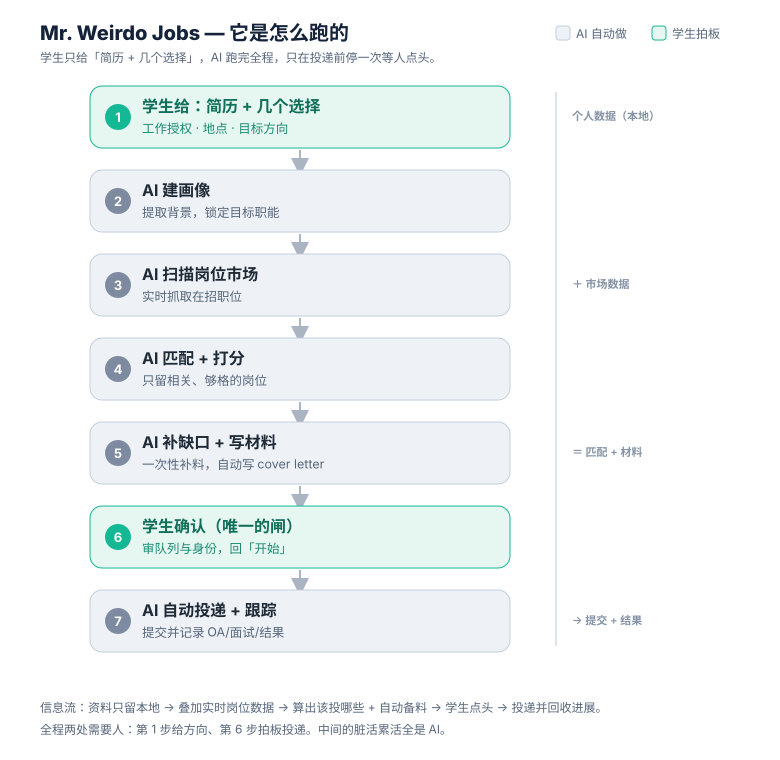

# 用 AI 杠杆化你们的求职辅导

### 让一个顾问，服务 3–5 倍的学生——而且质量更高

*一份给金融求职辅导机构的合作简介*

---

## 一、你们的瓶颈，是顾问的工时

一家求职辅导机构的产能上限，本质上是**初级顾问的可用工时**。在金融(IB / Sales & Trading)求职里，这个矛盾尤其尖锐：

- **岗位开得极早、又散**——投行暑期分析师往往在大二就开放，deadline 密集且分布在几十家公司，漏掉窗口是致命的。
- **每个学生都要大量重复行政**——跨 Workday 与各家门户反复填同样的资料、为每个岗位改一封 cover letter、追踪几百条申请的状态。
- **结果**：你们最贵的人(前投行背景的导师)被这些低价值脏活占住，真正能赢 offer 的 networking 与面试辅导反而被挤压。

> 学生付费买的是「定制」，却常常拿到「海投模板」——这是这个行业最大的投诉来源，也是顾问工时不够用的直接症状。

---

## 二、我们的解法：AI 接管脏活，顾问专注于人

我们把**「扫描 → 匹配 → 筛选 → 备料 → 投递 → 追踪」**这一整段重复劳动交给 AI，让顾问把人的时间留给 AI 做不了的部分——**networking、内推、面试辅导**。

**这不是「替代顾问」，而是「给每个顾问装上杠杆」。** 业内共识也很清楚：自动化作为「人主导的策略」里的一层才有效，盲目群投只会拉低命中率。所以「你们的顾问 ＋ 我们的 AI 层」是最强组合，而不是相互替代。

---

## 三、产品怎么跑（一张图讲清）

学生只给「简历 ＋ 几个选择」，AI 跑完全程，**只在投递前停一次**等学生点头：

1. **学生给**：简历 ＋ 工作授权 / 地点 / 目标方向(几个选择题)
2. **AI 建画像**：从简历提取背景，锁定目标职能
3. **AI 扫描岗位市场**：实时抓取在招职位，覆盖长尾
4. **AI 匹配 ＋ 打分**：只留**相关、够格**的岗位(按签证 / GPA / 方向硬筛)
5. **AI 补缺口 ＋ 写材料**：把缺的信息**一次性**问齐，自动生成逐岗位 cover letter
6. **学生确认**：审队列与提交身份，回一句「开始」——**唯一的人工闸门**
7. **AI 自动投递 ＋ 跟踪**：提交，并记录 OA / 面试 / 拒信 / offer 进展

> **信息流**：学生资料只留在本地 → 叠加实时岗位数据 → 算出该投哪些并自动备料 → 学生点头 → 投递并回收进展。

---

## 四、它具体怎么帮金融求职

| 你们顾问现在手工做的 | 系统接管后 |
|---|---|
| 满世界翻招聘页、追 deadline | 实时扫描 ＋ 队列，长尾不漏窗口 |
| 按签证 / GPA / 方向逐个判断岗位合不合适 | 相关性门控自动筛，差距过大的不投 |
| 一个个门户手填同样的资料 | 自动填表批量投递 |
| 为每个公司改一封信 | **有证据支撑的逐岗位文书**，打掉「海投模板」投诉 |
| Excel 追几百条申请状态 | 透明的全程追踪，进度随时可查 |

**留给你们顾问的(AI 不碰)**：networking、内推、OA 与面试辅导——金融拿 offer 的关键，恰好是人的价值所在。

---

## 五、为什么是「和你们一起建」，而不是买一个软件

- **白牌、为你们而建**：产出挂你们的牌子，装进你们顾问已有的工作流——不是一个让你们自己去配的通用软件，更不是一个对学生抢客户的 2C 品牌。
- **按你们的真实流程定制**：我会先摸清你们顾问每天怎么干，再把系统建在你们的约束与数据上(这套「前置部署工程」FDE 的打法，正是把服务做深、做成壁垒的方式)。
- **可扩展到你们常用的平台**：系统已支持主流 ATS 自动投递，并可针对**金融机构高频使用的申请平台**做扩展，以及把投行「Why this bank」类文书打磨得更锐。
- **透明、可追溯**：每一次自动操作都有记录，学生与顾问随时可查——直接缓解「服务中断 / 查不到进度」的纠纷。

---

## 六、怎么开始：从一个低风险的小试点

我们建议从最小一步迈起，先验证价值、再谈规模：

1. **付费试点(首选)**：一个 cohort / 两三个顾问，4–8 周，固定费用，明确指标——例如**每顾问工时完成的申请数**、**按时赶上 deadline 的比例**。
2. **为你们定制开发**：把系统建进你们的内部流程。
3. **授权 / 按席位或按学生收费**：试点验证后规模化。
4. **结果分成**：当 offer / placement 可归因时，把激励对齐。

---

### 关于这套系统

它最初是创始人**给自己用的求职系统**，已经能端到端真实跑通——真实投递、自动生成材料、自动追踪。我们想做的，是把这台已经验证的引擎，变成**专为你们金融学生跑通**的系统。

> **下一步**：给我们一次 30 分钟，让我们看一遍你们顾问的真实流程；我们回来给你一个**针对你们瓶颈**的试点方案。
